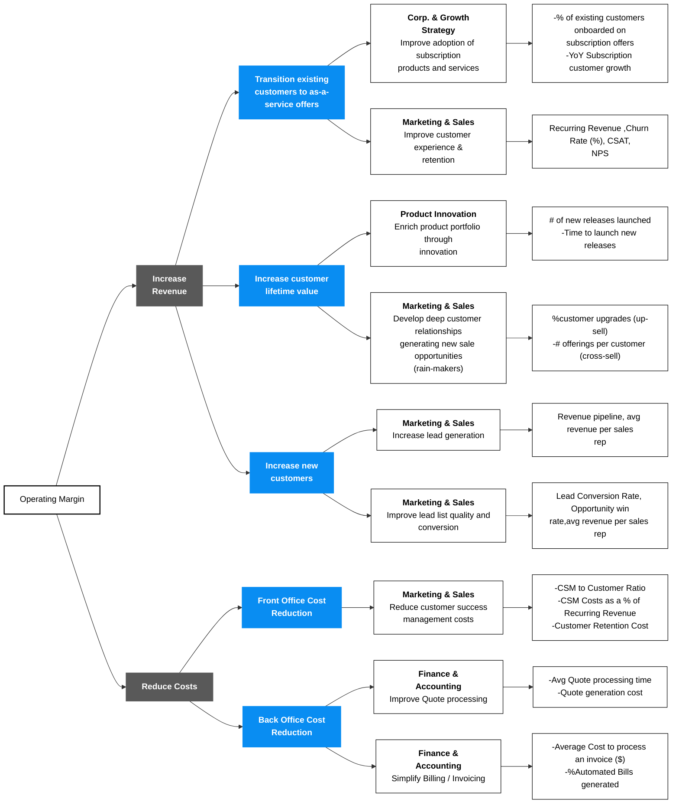

```mermaid

flowchart LR
  %% Transpiled from user-provided image
  %% Functional touchpoints based on MyIndustry ABA S-curve for HT

  OM["Operating Margin"]:::root

  IR["Increase<br/>Revenue"]:::dark
  RC["Reduce Costs"]:::dark

  OM --> IR
  OM --> RC

  IR --> TaaS["Transition existing<br/>customers to as-a-<br/>service offers"]:::blue
  IR --> CLV["Increase customer<br/>lifetime value"]:::blue
  IR --> NC["Increase new<br/>customers"]:::blue

  RC --> FOCR["Front Office Cost<br/>Reduction"]:::blue
  RC --> BOCR["Back Office Cost<br/>Reduction"]:::blue

  TaaS --> A1["<b>Corp. & Growth<br/>Strategy</b><br/>Improve adoption of subscription<br/>products and services"]:::white
  TaaS --> A2["<b>Marketing & Sales</b><br/>Improve customer experience &<br/>retention"]:::white

  A1 --> K1["-% of existing customers onboarded on<br/>subscription offers<br/>-YoY Subscription customer growth"]:::kpi
  A2 --> K2["Recurring Revenue ,Churn Rate (%), CSAT,<br/>NPS"]:::kpi

  CLV --> A3["<b>Product Innovation</b><br/>Enrich product portfolio through<br/>innovation"]:::white
  CLV --> A4["<b>Marketing & Sales</b><br/>Develop deep customer relationships<br/>generating new sale opportunities<br/>(rain-makers)"]:::white

  A3 --> K3["# of new releases launched<br/>-Time to launch new releases"]:::kpi
  A4 --> K4["%customer upgrades (up-sell)<br/>-# offerings per customer (cross-sell)"]:::kpi

  NC --> A5["<b>Marketing & Sales</b><br/>Increase lead generation"]:::white
  NC --> A6["<b>Marketing & Sales</b><br/>Improve lead list quality and<br/>conversion"]:::white

  A5 --> K5["Revenue pipeline, avg revenue per sales<br/>rep"]:::kpi
  A6 --> K6["Lead Conversion Rate, Opportunity win<br/>rate,avg revenue per sales rep"]:::kpi

  FOCR --> A7["<b>Marketing & Sales</b><br/>Reduce customer success<br/>management costs"]:::white
  A7 --> K7["-CSM to Customer Ratio<br/>-CSM Costs as a % of Recurring Revenue<br/>-Customer Retention Cost"]:::kpi

  BOCR --> A8["<b>Finance &<br/>Accounting</b><br/>Improve Quote processing"]:::white
  BOCR --> A9["<b>Finance &<br/>Accounting</b><br/>Simplify Billing / Invoicing"]:::white

  A8 --> K8["-Avg Quote processing time<br/>-Quote generation cost"]:::kpi
  A9 --> K9["-Average Cost to process an invoice ($)<br/>-%Automated Bills generated"]:::kpi

  classDef root fill:#ffffff,stroke:#000000,stroke-width:2px,color:#000000;
  classDef dark fill:#595959,stroke:#595959,color:#ffffff,font-weight:bold;
  classDef blue fill:#098df2,stroke:#098df2,color:#ffffff,font-weight:bold;
  classDef white fill:#ffffff,stroke:#000000,color:#000000;
  classDef kpi fill:#ffffff,stroke:#000000,color:#000000;

```