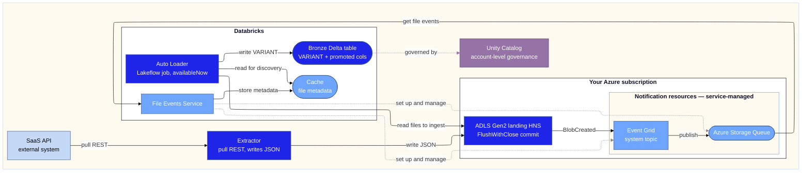

# ADLS Gen2 to bronze ingestion: locked design

> Event-driven ingestion of JSON from a SaaS source into a bronze Delta table.
> Locked on option A1b, Auto Loader with managed file events.
> Pairs with 2026-06-09-adls-bronze-ingestion-design.md (the full option comparison).

This document is the locked design. The option comparison that produced it lives in the paired design doc and is not repeated here. All claims are checked against current Azure Databricks documentation (June 2026).

## Locked decision

The ingestion path is A1b, Auto Loader with managed file events, on a Unity Catalog external location. The run mode is a scheduled `Trigger.availableNow` batch. A continuous stream is used only if a sub-minute freshness SLA is set. The deciding inputs are the extractor's pull cadence and the bronze freshness target, both of which favour the scheduled batch for a periodic puller.

Three facts underpin the decision and are stated once:

- From Databricks Runtime 18.1, Auto Loader uses managed file events automatically when available (`useManagedFileEvents = if_available`). On earlier runtimes the option is set explicitly. This is documented in the File events FAQ [F], not in the file-events-explained [5] or file-notification-mode [4] pages, so verify against the FAQ.
- File events are enabled by default on new Unity Catalog external locations, with an explicit opt-out (`enable_file_events=false`). Enabling them is no longer a manual prerequisite.
- On the managed path the file events service provisions and owns the Event Grid subscription and storage queue, one shared pair per external location [5]. You do not configure that subscription, so its event filter is not yours to set. The docs do not state that the managed subscription filters on FlushWithClose, so on HNS the safety against premature CreateFile events rests on the idempotent ingest, not on a filter you applied. If you need to own the FlushWithClose filter, use the bring-your-own-queue variant, where `useManagedFileEvents` is kept but you supply your own storage queue and the subscription that feeds it [5].

## Why A1b

A1b's profile against the platform selection criteria. Ratings are 1 to 5 on how well A1b satisfies each criterion (5 best), weighted by the platform criterion weight.

| # | Criterion | Weight | Rating | Weighted | Rationale |
| :--- | :--- | ---: | ---: | ---: | :--- |
| 1 | Compute cost impact | 5 | 3 | 15 | A continuous stream bills idle between pulls. The scheduled availableNow run mode drops idle compute and lifts this toward 4 |
| 2 | Latency, event to bronze | 3 | 4 | 12 | Cache hop adds a small delay with no per-run cluster start in continuous mode. A scheduled batch adds the schedule interval |
| 3 | Scale ceiling and limits | 3 | 4 | 12 | One managed queue per external location scales to many streams when each is scoped to a per-subpath volume |
| 4 | Operational ownership | 5 | 5 | 25 | One managed stream, managed tuning and cleanup, fewest moving parts |
| 5 | Ingestion guarantee | 5 | 5 | 25 | Auto Loader exactly-once via the RocksDB checkpoint, resumable on restart |
| 6 | Maturity and longevity | 3 | 4 | 12 | Managed file events is the documented default on a current runtime, a GA mechanism |
| 7 | Source format coverage | 2 | 4 | 8 | Reads JSON through the standard Auto Loader reader, whole-record VARIANT absorbs schema drift |
| 8 | Security surface and access governance | 5 | 5 | 25 | Stays inside the governed plane on the access connector identity, no self-operated component, no orchestration layer |
| 9 | GDPR and data protection | 3 | 4 | 12 | Inherits Unity Catalog lineage, classification and governed access |
| | Total (max 170) | | | 146 | |

Verdict: A1b run as a scheduled availableNow batch is the strongest single configuration for a periodic pull extractor. It keeps idle compute low while retaining the operational-ownership and security lead the profile shows. The fallback is a continuous A1b stream, used only if a sub-minute freshness SLA appears. The pull cadence and the bronze freshness target remain the inputs that finalise the configuration.

## Glossary

Scoped to the concepts this design uses.

| Term | Meaning |
| :--- | :--- |
| ADLS Gen2 | Azure Data Lake Storage Gen2, a set of capabilities on Azure Blob Storage unlocked by the hierarchical namespace. The raw landing zone here |
| HNS | Hierarchical namespace, the storage-account setting that gives file-system semantics, directory atomicity and the Data Lake event set |
| abfss / dfs endpoint | The ABFS driver and the `dfs.core.windows.net` endpoint through which Databricks reads ADLS Gen2 |
| CreateFile / FlushWithClose | The Data Lake Gen2 write operations. FlushWithClose marks the file fully committed, the only safe trigger boundary |
| Event Grid system topic | The Azure Event Grid topic that publishes storage events for the account |
| Microsoft.Storage.BlobCreated | The storage event raised on file creation. On HNS it fires for both CreateFile and FlushWithClose. A subscription filtered on FlushWithClose fires only on a committed file. On the managed path the subscription is service-owned, so this filter is not under your control unless you bring your own queue |
| File events (managed) | A Databricks service that provisions and owns the Event Grid subscription and storage queue (one shared pair per external location), listens to storage notifications, caches file metadata, and serves discovery to Auto Loader |
| Bring-your-own-queue variant | Managed file events kept (`useManagedFileEvents`) but with a storage queue and subscription you provision and own, so the FlushWithClose filter and the eventing surface are under your control [5] |
| External location | A Unity Catalog object that grants governed access to a cloud storage path |
| UC volume | A Unity Catalog volume mapping a subpath. Discovery is scoped to a per-subpath volume to keep file events efficient |
| Auto Loader | The Databricks incremental file-ingestion engine (`cloudFiles`), exactly-once via checkpoint |
| cloudFiles.useManagedFileEvents | The Auto Loader option that reads from the managed file events cache. Automatic on DBR 18.1+ |
| Trigger.availableNow | A batch trigger that processes all files present at start, then stops. The locked run mode |
| Checkpoint (RocksDB) | The Auto Loader state store that tracks discovered files and gives exactly-once and resume-on-restart |
| File events cache | The Databricks-managed metadata index that the file events service writes and Auto Loader reads for discovery. Internal to the service, not separately addressable, and distinct from the RocksDB checkpoint |
| cloudFiles.cleanSource | The Auto Loader option that archives or deletes processed source files (DBR 16.4 LTS+). A storage-cost lever here |
| cloudFiles.backfillInterval | The Auto Loader option that triggers periodic backfills against rare missed notifications, without duplicates. Unsupported on the managed path, where backfill is automatic |
| VARIANT | The semi-structured column type (DBR 15.3+, Public Preview) holding the whole JSON record |
| singleVariantColumn | The Auto Loader option that ingests the whole record into one VARIANT column |
| corruptRecordColumn | The column that captures malformed or oversized (>16 MB) records under PERMISSIVE mode |
| Promoted columns | Typed columns extracted alongside the VARIANT (ingest_ts, source_path, business_key) for keys used to filter, join, cluster or partition |
| Access connector / managed identity | The Azure managed identity, via the Databricks access connector, that authorises the file events service against storage |
| Lakeflow job | The Databricks job that runs the Auto Loader stream on schedule |

## Diagram

Diagram class semantics. `primary` (electric blue) marks what the A1b lock-in specialises or adds: the extractor, ADLS, Auto Loader and bronze. `secondary` (sky blue) marks the managed file-events mechanism preserved from the Databricks reference diagram. `tertiary` (ice blue) marks the external source system. `govern` (mauve) marks Unity Catalog as the account-level governance metastore. There are two kinds of dashed edge. Grey dashed edges are the file events service control plane (set up and manage), which originate at the service because it owns the Event Grid subscription and queue. The mauve dashed edge is the governance dependency, bronze governed by the metastore. Solid edges are the data plane. The discovery edge runs from Auto Loader to the cache, since Auto Loader reads file metadata directly from the file events cache, not from the service front door and not by polling the queue [5].

The full per-step annotations (unique filenames, cleanSource retention, 7-day expiry, 24h reconciliation, VARIANT 16 MB cap and case sensitivity) sit in the design-steps table and glossary below rather than on the diagram. Container technology per component sits in the component inventory below.

## Design steps

| Design step | Technical elements | Benefits | Watch-outs | Sources |
| :--- | :--- | :--- | :--- | :--- |
| 1. Extract from SaaS source | External extractor (already running), SaaS REST client, emits JSON files | Decoupled from Databricks, owns SaaS auth and pagination | Scheduling and retry are the extractor's, no native exactly-once upstream | [7] |
| 2. Land file to ADLS Gen2 | ADLS Gen2 (HNS), abfss driver, CreateFile + FlushWithClose, unique filenames, cloudFiles.cleanSource (DBR 16.4 LTS+) | Durable landing, FlushWithClose gives a clean commit boundary, cleanSource caps source-directory storage cost | Same-name overwrite does not retrigger discovery, so keep unique filenames. Discovery is incremental, so cleanSource is a storage-cost lever, not a discovery-speed one | [1][3][8] |
| 3. Emit event, ADLS to the file events queue | Event Grid subscription + storage queue. On the managed path the file events service provisions and owns this pair, one per external location. Microsoft.Storage.BlobCreated (HNS fires on both CreateFile and FlushWithClose) | Native push, no polling, no resources for you to operate on the managed path | The managed subscription is service-owned, so you do not set its filter. The docs do not state it filters on FlushWithClose, so premature CreateFile events are handled by the idempotent ingest. To own a FlushWithClose filter, use the bring-your-own-queue variant. At-least-once delivery means duplicates are possible regardless | [2][3][5] |
| 4. Catch and ingest, managed file events | Auto Loader stream, useManagedFileEvents=true (automatic on DBR 18.1+), one managed queue per UC external location, per-subpath volume, reads cache for discovery and storage for bytes, Trigger.availableNow on a schedule, RocksDB checkpoint exactly-once | Fewest moving parts, one queue per location, no extra creds, managed tuning and cleanup, default-on, exactly-once | Cache hop adds latency, run at least every 7 days or it falls back to a full listing, 24h reconciliation scan, scope to a per-subpath volume to avoid rate limiting | [4][5][6] |
| 5. Write to bronze as VARIANT | Delta bronze table, singleVariantColumn whole-record VARIANT (DBR 15.3+), promoted columns (ingest_ts, source_path, business_key) | Schema-flexible semi-structured storage, replaces JSON strings, queryable | VARIANT cannot be a partition, clustering or Z-order key nor used in compare, group or order, so promote keys. Path access is case-sensitive. 16 MB record cap. Public Preview | [9][10] |

## Component inventory

Container technology and ownership per component on the diagram. "Owned by" is who provisions and operates the component, which is what matters for setup and cost.

| Component | Container technology | Owned by |
| :--- | :--- | :--- |
| Extractor | External SaaS REST client, emits JSON | You, external to Databricks |
| ADLS Gen2 landing | ADLS Gen2 with HNS, read over the abfss driver | You, Azure subscription |
| Event Grid + Storage Queue | Azure Event Grid subscription and Azure Storage Queue, one shared pair per external location | File events service, service-managed |
| File Events Service | Databricks-managed service | Databricks |
| File events cache | Databricks-managed internal metadata index for discovery, not separately addressable | Databricks |
| Auto Loader | Lakeflow job running Spark Structured Streaming (`cloudFiles`), Trigger.availableNow | You configure the job, Databricks runs the runtime |
| Auto Loader checkpoint | RocksDB state store in the checkpoint location, holds read position and processed-file set | You, on durable storage you choose |
| Bronze table | Delta Lake table, single VARIANT column plus promoted typed columns | You, governed by Unity Catalog |
| Unity Catalog | Account-level governance metastore, one per region, attached to workspaces | Databricks account admin |

## Implementation notes

Items surfaced while mapping the components to the diagram. They refine, not replace, the standing checks below.

1. Discovery reads the cache, not the service front door and not the queue. Auto Loader with `useManagedFileEvents` reads new-file metadata directly from the file events cache, using the read position held in its checkpoint. There is no queue consumer for you to write and no cache endpoint for you to provision. The diagram edge is Auto Loader to the cache for this reason [5].
2. The cache and the checkpoint are two different stores, do not conflate them. The file events cache is the Databricks-managed metadata index used for discovery. The RocksDB checkpoint is the Auto Loader state store holding the read position and the processed-file set for exactly-once [5]. Keep the checkpoint location durable and unique per stream. If it is lost, Auto Loader does a full re-listing and re-establishes a read position, so the idempotent ingest (check 13) is what prevents double counting.
3. Nothing to provision for the cache itself. It is internal to the file events service and not separately addressable. The only service-managed resources are the Event Grid subscription and the storage queue, one pair per external location.
4. Unity Catalog is account-level, not a workspace component. One metastore per region, attached to workspaces. Configure governance, that is grants, lineage and classification, at the catalog, schema and table level, not as part of the ingestion job. Bronze is governed by it, shown as the governance edge. Do not model it inside the Databricks workspace boundary.
5. On the first run Auto Loader does one full directory listing to get current with the cache and to seed the read position, then stores that position in the checkpoint [5]. Plan for that first-run listing cost on a large existing directory.

## Standing checks before a production commitment

Items 1 to 8 are runtime and ingestion checks. Items 9 to 13 are the storage and integrity security baseline, which applies regardless of the design.

1. Confirm the target workspace runtime is DBR 18.1 or above for the automatic file-events default. On an earlier runtime set `cloudFiles.useManagedFileEvents=true` explicitly. Verify the automatic behaviour against the File events FAQ [F].
2. Confirm managed file events are enabled on the external location the stream reads, or accept the default-on behaviour, and confirm the workspace is not gated behind a regional allowlist preview.
3. Decide who owns the FlushWithClose filter. On the default managed path the subscription is service-owned and the docs do not state it filters on FlushWithClose, so premature CreateFile events are absorbed by the idempotent ingest. If a FlushWithClose filter must be enforced at the subscription, adopt the bring-your-own-queue variant and own the queue and subscription. Confirm the managed default's HNS event behaviour against the File events FAQ [F] before relying on either.
4. Keep unique filenames or a flag file. Overwriting a file with the same name does not fire a notification.
5. Treat the VARIANT bronze write as Public Preview. Promote any key used for partition, clustering, filter, join, group or order into a typed column. Match field casing exactly, since path access is case-sensitive.
6. Scope discovery to a per-subpath Unity Catalog volume rather than the bare external location, to avoid the Too many requests rate limit when several streams read different subpaths under one location.
7. Run the stream at least once every 7 days, or the stored read position expires and Auto Loader falls back to a full directory listing. A scheduled availableNow run satisfies this.
8. If a data-completeness SLA applies, rely on the automatic managed backfill. `cloudFiles.backfillInterval` is unsupported on the managed path. Use it only on the bring-your-own-queue or classic path. Backfills do not cause duplicates.
9. Lock write access to the landing zone to the extractor identity alone, so no other principal can land a file.
10. Put the storage account on a private network, no public access, with firewall rules and private endpoints.
11. Enforce encryption at rest, platform or customer-managed keys, and in transit.
12. Validate content before the write into bronze, schema and contract checks, size and type limits, and quarantine anomalies. Treat unstructured or binary uploads as untrusted.
13. The ingest must be idempotent so a forged, premature or duplicate event cannot inject or double-count data. This is the primary defence on the managed path, where you do not control the subscription filter. Pair it with check 9 so only the trusted extractor identity can land a file in the first place.

## Official sources

| Ref | Topic | Link |
| :--- | :--- | :--- |
| 1 | ADLS Gen2 introduction | [learn.microsoft.com](https://learn.microsoft.com/en-us/azure/storage/blobs/data-lake-storage-introduction) |
| 2 | Blob storage events overview | [learn.microsoft.com](https://learn.microsoft.com/en-us/azure/storage/blobs/storage-blob-event-overview) |
| 3 | Blob storage event schema | [learn.microsoft.com](https://learn.microsoft.com/en-us/azure/event-grid/event-schema-blob-storage) |
| 4 | Auto Loader file notification mode | [learn.microsoft.com](https://learn.microsoft.com/en-us/azure/databricks/ingestion/cloud-object-storage/auto-loader/file-notification-mode) |
| 5 | Auto Loader with file events overview | [learn.microsoft.com](https://learn.microsoft.com/en-us/azure/databricks/ingestion/cloud-object-storage/auto-loader/file-events-explained) |
| 6 | Auto Loader file detection modes | [learn.microsoft.com](https://learn.microsoft.com/en-us/azure/databricks/ingestion/cloud-object-storage/auto-loader/file-detection-modes) |
| 7 | Standard connectors in Lakeflow Connect | [learn.microsoft.com](https://learn.microsoft.com/en-us/azure/databricks/ingestion/) |
| 8 | Configure Auto Loader for production | [learn.microsoft.com](https://learn.microsoft.com/en-us/azure/databricks/ingestion/cloud-object-storage/auto-loader/production) |
| 9 | Ingest data as variant | [learn.microsoft.com](https://learn.microsoft.com/en-us/azure/databricks/ingestion/variant) |
| 10 | Variant versus JSON strings | [learn.microsoft.com](https://learn.microsoft.com/en-us/azure/databricks/semi-structured/variant-json-diff) |
| F | File events FAQ | [learn.microsoft.com](https://learn.microsoft.com/azure/databricks/connect/unity-catalog/cloud-storage/file-events-faq) |

---

| Field | Value |
| :--- | :--- |
| Version | 1.4 |
| Last Updated | 2026-06-11 |
| Status | Review |
