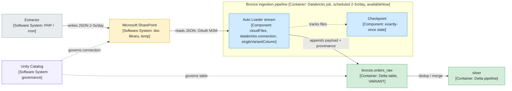

# JSON on SharePoint to Databricks bronze, the temporary landing design

> The build recipe for automating an existing, manually-ingested SharePoint-to-
> Databricks JSON flow as a quick win, while SharePoint is still the landing.
> The temporary-zone instance whose end state is the ADLS play. When SharePoint
> retires and the extractor repoints to ADLS, that sibling governs.
>
> VARIANT and standard-connector claims are tech-verified against Microsoft Learn
> on 2026-06-13. One residual gap remains, the singleVariantColumn plus
> databricks.connection composition. See Sources.

## When to trigger

A PHP or cron extractor already writes timestamped JSON files to a SharePoint document library, and today those files are loaded into Databricks by hand. You want a governed scheduled load into bronze as a quick win, knowing SharePoint is a temporary landing that will move to ADLS later. The recognition signal is a working-but-manual setup: the extractor runs, the files arrive, and the only missing piece is the governed, scheduled load.

Concrete examples:

- The originating session: 5 JSON files, 2 to 3 imports per day, names prefixed YYYY-MM-DD-HH-MM, some files regenerated in full and some incremental, loaded manually today.
- Any Databricks shop where a SaaS extractor parks JSON on a SharePoint library and a person runs the ingest notebook on demand.

## Why it matters

The deliverable is a governed, scheduled Databricks pipeline that replaces the manual step, reads JSON straight from SharePoint through a Unity Catalog connection with no intermediate store, lands each record raw as a VARIANT column in bronze, and is built so the later ADLS migration swaps only the source path and the trigger. It also steers around the two wrong turns the format and the connector invite, which cost real time in the session.

## What this design accepts and what it defers

This is a bounded-phase design. It accepts two compromises that the permanent ADLS design removes, and defers two hardening decisions to that end state.

| Item | Posture on SharePoint | Resolved in the ADLS end state |
| :--- | :--- | :--- |
| Beta standard SharePoint connector, DBR 17.3 LTS floor | Accepted for the bounded phase, with a review date set | Gone. Replaced by a UC External Location, VARIANT floor (DBR 15.3) governs alone |
| Scheduled availableNow poll | Accepted as the trigger stand-in | Replaced by a native file-arrival trigger |
| Routing by URL folder scope plus pathGlobFilter on name | URL scope selects the folder, sub-site, or library, pathGlobFilter narrows by name. Folder-path glob filtering is unsupported | ADLS adds per-type Volume isolation and folder routing on the External Location |
| Fidelity (byte-faithful copy) | Deferred. VARIANT-only, revisit only if an audit obligation appears | Hardened. Both an in-row STRING and a retained file decided up front |

What carries over unchanged to the end state: singleVariantColumn to a payload VARIANT, append-only bronze, the 16 MB VARIANT per-record cap, multiLine matched to file shape, immutable uniquely-named files, and full-refresh versus incremental resolved in silver.

## Flow

A C4 component view scoped to the bronze ingestion pipeline container.



The connection and the 2-to-3-a-day schedule are not components. They are relationship and qualifier metadata: the connection is the technology on the read edge, the schedule is a property of the pipeline container. Solid edges are the data path, dashed edges are governance and state associations. At ADLS migration the supporting elements change but the components do not. Microsoft SharePoint becomes a UC External Location on ADLS Gen2, and the pipeline qualifier changes from scheduled availableNow to a native file-arrival trigger.

## The play

### Optimal workflow

1. Confirm SharePoint is temporary, and keep it as the landing for now. Do not pre-stage to ADLS for the quick win.
2. Create a Unity Catalog connection for the standard SharePoint connector using OAuth M2M (app-only, a service principal via an Entra app registration, recommended for automated pipelines), scoped with Sites.Selected or Sites.Read.All for read access. Enable the SharePoint Beta from the workspace Previews page and run on Databricks Runtime 17.3 LTS or above. Set a review date for the Beta dependency.
3. Confirm the file format is JSON up front. One Auto Loader path, no CSV or Excel branching.
4. Land each record as a single VARIANT column with singleVariantColumn, targeting a pre-created bronze table of payload VARIANT plus provenance columns.
5. Enrich each row with the source filename and an ingest timestamp, then append to the bronze Delta table.
6. Run as a scheduled job, 2 to 3 times per day, with the stream in availableNow so each fired run drains and stops. The schedule is the temporary stand-in for the future file-arrival trigger.
7. Scope the read to the target folder, sub-site, or document library via the load URL, then narrow within it with pathGlobFilter on the name. URL folder scoping is supported, only folder-path glob filtering is not.
8. Resolve full-refresh versus incremental files in silver, by deduplication or merge on business key plus load timestamp. Bronze stays append-only. Every produced file must carry a unique name, full-refresh regenerations included, since Auto Loader at the default allowOverwrites=false ingests each path exactly once and will not reload a same-name overwrite.

### Critical moves

| Move | Collapse test |
| :--- | :--- |
| Using the standard SharePoint connector (read_files, Auto Loader, COPY INTO via databricks.connection), not the managed one | Skip it and the managed connector lands binary one-file-per-row, not the queryable JSON to VARIANT path this design needs |
| Pinning the format as JSON, collapsing the earlier CSV-via-Auto-Loader plus Excel-via-COPY-INTO split into one path | Skip it and the design carries a needless dual path and a double-beta dependency |
| singleVariantColumn to VARIANT, which also removes schema evolution because the variant absorbs drift | Skip it and you fight nested-JSON schema evolution in bronze |
| Reading SharePoint directly through the UC connection, no ADLS hop for the quick win | Skip it and you build a bridge you will delete at migration |
| availableNow scheduled run as the trigger stand-in, over a source-agnostic loader | Skip it and the ADLS migration becomes a rewrite rather than a path-and-trigger swap |
| URL folder scope to select the path, pathGlobFilter on name to narrow within it | Skip it and you over-read a whole library, or assume folder-path globbing the connector does not support |

### Pits to avoid

- Designing for CSV and Excel before confirming the format is JSON. This was the actual detour in the session.
- Reaching for the managed SharePoint connector. It outputs a binary one-file-per-row table for RAG-style use, not the structured JSON to VARIANT path. The standard connector is the one that ingests JSON into a queryable table.
- Treating VARIANT as byte-faithful. It is a normalised parsed tree, not the original bytes. Key order, insignificant whitespace, and duplicate keys are not preserved.
- The 16 MB VARIANT per-record cap. A record over 16 MB is treated like a corrupt record and lands in corruptRecordColumn under PERMISSIVE, not in the payload.
- Setting multiLine wrong for the file shape. Newline-delimited JSON needs it off, a single object or array per file needs it on.
- Assuming a same-name regenerated file will reload. Auto Loader defaults to allowOverwrites=false and ingests each path exactly once, so a full-refresh file that reuses a name will not reprocess. Keep every file name unique per run, full-refresh regenerations included. Databricks recommends ingesting immutable files only.
- Expecting a file-arrival trigger to watch SharePoint. It sees only Unity-Catalog-governed storage, so the schedule is the only trigger here.
- Expecting cloudFiles.cleanSource to clean up at the source. It is not supported on the standard SharePoint connector, so source-file cleanup or archival at SharePoint stays manual.
- Trying to read more than one site in one query. Multi-site ingestion in a single query is unsupported. One query reads one site, so a second site means a second query and pipeline.
- Running a Beta connector on a production path with no review date set.
- Putting cron or the connection inside a [Container: ...] label in any diagram. Both are trigger or relationship metadata, not containers.

## On fidelity

The landing is temporary, so the fidelity decision is deferred, not made here. The design lands VARIANT only and revisits byte-faithful capture only if an audit or replay obligation appears within this phase. The permanent ADLS end state is where fidelity is decided up front, keeping both an in-row byte-faithful STRING and a retained landed file. Carrying that decision now would harden a zone you intend to retire.

If an audit obligation does appear before migration, the cheapest in-phase answer is to dual-land a byte-faithful STRING beside the VARIANT, which forecloses singleVariantColumn (the whole record becomes the one VARIANT column, so true byte capture means reading text then parsing it instead). Do not casually cast VARIANT back to a string and call it the original, that is reparsed text, not the source bytes.

## On the VARIANT type

VARIANT is a single column type holding a whole JSON-like value (object, array, scalar, or nested mix) as a parsed binary structure, queryable in place. Three properties matter here.

It is parsed, not text. The JSON is decoded once at write time into a typed binary encoding, so the string "42" and the number 42 stay distinguishable. It is not the source file byte for byte.

It is accessed by path, like payload:customer.id with a cast such as ::int, and those reads are cheap because the parse already happened rather than on every query. Path access is case-sensitive, so payload:Field and payload:field address different fields.

It is schema-flexible, so one column absorbs differing and evolving record shapes with no table change, which is why schema evolution drops out of this design.

The caveat under Pits to avoid still holds: VARIANT is a normalised parse, not the original bytes, so it gives the document faithfully and queryably, not the file byte for byte.

## When to use it

- The extractor already lands JSON on SharePoint and ingestion is manual today.
- A Unity Catalog workspace on DBR 17.3 LTS or above, with the ability to register an Entra app for OAuth M2M auth.
- Per-record JSON sits under the 16 MB VARIANT cap, format confirmed JSON.
- The temporary landing is accepted, so a Beta connector is tolerable for a bounded phase.

## When not to use it

- The format is not JSON, or is mixed. Re-open the format-path decision first.
- Byte-exact audit or replay is required now. Dual-land a STRING column alongside VARIANT, or move to the ADLS design.
- Records exceed 16 MB. The single VARIANT column rejects them into the corrupt-record column.
- Files are regenerated under the same name and cannot be renamed. Auto Loader will not reload a same-name overwrite at the default allowOverwrites=false. Switch to a unique-name scheme upstream first.
- SharePoint is permanent. Go to ADLS plus a file-arrival trigger now and use the sibling play, skipping the Beta connector.
- The SaaS is a supported Lakeflow Connect managed connector. Ingest the SaaS directly and retire both SharePoint and the extractor.

## Expected outcome

| Promise | How to check |
| :--- | :--- |
| The manual ingestion step is replaced by a governed scheduled job | The manual run no longer exists and a scheduled job owns the load |
| Bronze holds payload VARIANT plus provenance, append-only | The table schema is payload VARIANT, source filename, ingest timestamp, and no row is mutated in place |
| Oversized records are surfaced, not lost | Any record over 16 MB appears in the corrupt-record column rather than vanishing from the payload |
| Each produced file is ingested once | File names are unique per run, full-refresh regenerations included, allowOverwrites left at its default false, and the Auto Loader checkpoint lists every produced file as processed |
| The later ADLS migration changes only the load path and the trigger | A diff of the loader shows changes confined to the .load() target and the trigger configuration |

## Tradeoffs

Connector and path

| Decision | Pole A | Pole B | Chosen position |
| :--- | :--- | :--- | :--- |
| Connector variant | Managed SharePoint connector | Standard SharePoint connector | Standard. The managed connector outputs binary one-file-per-row, the standard one ingests JSON into structured Delta as VARIANT |
| Read path | DIY Graph or ADLS bridge | Native standard connector (read_files / Auto Loader) | Native connector, direct read, no ADLS hop |
| Replace the extractor | UC HTTP connection with http_request to call the SaaS directly | Keep the PHP extractor and SharePoint | Keep the extractor. http_request is a per-call primitive, not an ingestion source, SOAP makes it clumsy, and it re-implements extraction for thin gain |

Format and representation

| Decision | Pole A | Pole B | Chosen position |
| :--- | :--- | :--- | :--- |
| Format path | CSV plus Excel dual path | Single JSON path | Single JSON Auto Loader path |
| Raw type | Inferred struct with schema evolution | VARIANT single column | VARIANT, evolution drops out |
| Fidelity | Byte-exact STRING now | Queryable VARIANT only | VARIANT only, revisit only if an audit obligation appears in this phase |

Triggering and routing

| Decision | Pole A | Pole B | Chosen position |
| :--- | :--- | :--- | :--- |
| Trigger | Native file-arrival | Scheduled poll | Scheduled poll with availableNow, because SharePoint cannot fire the native trigger |
| Routing | Folder-path glob filter | URL folder scope plus pathGlobFilter on name | URL scope selects the folder, pathGlobFilter narrows by name, folder-path glob unsupported |

## Reference implementation

One file pattern maps to one bronze table, each with its own checkpoint. Repeat the block per file, or wrap it in a loop over a list of (glob, table) pairs. The schedule and availableNow mode make this a fire-drain-stop job, not an always-on stream.

PySpark, Auto Loader streaming:

```python
from pyspark.sql.functions import col, current_timestamp

# Pre-create bronze: one VARIANT column plus provenance
spark.sql("""
  CREATE TABLE IF NOT EXISTS bronze.orders_raw (
    payload       VARIANT,
    _source_file  STRING,
    _ingested_at  TIMESTAMP
  )
""")

df = (spark.readStream.format("cloudFiles")
    .option("cloudFiles.format", "json")
    .option("databricks.connection", "my_sharepoint_conn")  # the standard SharePoint connection
    .option("singleVariantColumn", "payload")               # whole record into one VARIANT
    .option("pathGlobFilter", "*-orders.json")              # narrows by name within the URL-scoped path
    .option("multiLine", "true")                            # true for one object/array per file, off for NDJSON
    .load("https://<tenant>.sharepoint.com/sites/<site>/<library>/<folder>"))  # URL scopes the read

out = df.select(
    col("payload"),
    col("_metadata.file_path").alias("_source_file"),
    current_timestamp().alias("_ingested_at"))

(out.writeStream
    .option("checkpointLocation", "<checkpoint-path>/orders")
    .trigger(availableNow=True)        # drain everything new since last run, then stop
    .toTable("bronze.orders_raw"))
```

SQL equivalent, for a Lakeflow declarative pipeline (set "CHANNEL" = "PREVIEW" in pipeline settings while the connector is Beta):

```sql
CREATE OR REFRESH STREAMING TABLE bronze.orders_raw AS
SELECT *, _metadata.file_path AS _source_file, current_timestamp() AS _ingested_at
FROM STREAM read_files(
  'https://<tenant>.sharepoint.com/sites/<site>/<library>/<folder>',
  `databricks.connection` => 'my_sharepoint_conn',
  format              => 'json',
  singleVariantColumn => 'payload',
  pathGlobFilter      => '*-orders.json',
  multiLine           => true);
```

Notes:

- With singleVariantColumn there is no schema to infer, so no schemaLocation is needed. The checkpointLocation alone tracks which files have been processed. The official singleVariantColumn examples confirm this, using checkpointLocation only.
- Point .load() at the specific folder, sub-site, or library. The URL scopes the read. pathGlobFilter narrows by name within it. Folder-path glob filtering is unsupported.
- Set multiLine to match the file shape. Newline-delimited JSON needs it off, a single object or array per file needs it on.
- Each record must stay under the 16 MB VARIANT cap. Oversized records land in corruptRecordColumn under PERMISSIVE.
- Keep file names unique per run. Auto Loader at the default allowOverwrites=false ingests each path exactly once and will not reload a same-name overwrite.
- cloudFiles.cleanSource is not supported on this connector, so source cleanup at SharePoint is manual.
- Combining singleVariantColumn with databricks.connection is the logical composition but is not shown together in an official example. The official singleVariantColumn examples read from a UC Volume or object-store path, not a SharePoint connection. Test on one file before committing (see Sources).

## Sources

Load-bearing claims mapped to source. Connector and VARIANT claims were fetched
and verified against Microsoft Learn on 2026-06-13 (SharePoint ingestion page
updated 2026-03-16, SharePoint auth overview updated 2025-12-11, VARIANT page in
Public Preview, Auto Loader production and FAQ pages Mar to May 2026). The
ingestion-overview source [9] is carried from the options doc
(2026-06-09-adls-bronze-ingestion-design-options.md, v1.4).

| Claim in this play | Source |
| :--- | :--- |
| Two SharePoint connectors (managed binary output, standard structured output), standard connector via databricks.connection with read_files, Auto Loader and COPY INTO, Beta status, DBR 17.3 LTS floor, URL folder scope, pathGlobFilter on name, folder-path glob unsupported, no multi-site per query, cleanSource unsupported | [13] |
| OAuth M2M recommended for automated pipelines (app-only, service principal), Sites.Selected or Sites.Read.All scope | [14] |
| VARIANT type, JSON from DBR 15.3, Public Preview, singleVariantColumn whole-record ingest, 16 MB record cap, oversized and malformed records to corruptRecordColumn under PERMISSIVE, whole-record VARIANT disables schema evolution and rescuedDataColumn, maintains case sensitivity | [11] |
| VARIANT is a normalised parsed tree not the original bytes, and path access is case-sensitive | [11][12] |
| Auto Loader checkpoint (RocksDB) gives exactly-once ingestion, resumes from the last checkpoint, no manual state | [10] |
| Default allowOverwrites=false processes each file path exactly once, a same-name overwrite is not reliably reprocessed, immutable files recommended | [F-AL] |
| Scheduled Trigger.AvailableNow for regular-interval arrivals, run after the anticipated arrival time, AvailableNow from DBR 10.4 LTS | [F-AL] |
| Auto Loader cloudFiles detection modes, checkpoint independent of mode | [6] |
| Databricks managed ingestion and Lakeflow Connect managed connectors, the basis for retiring the extractor when a connector covers the source | [9] |
| Native file-arrival trigger, the end-state mechanism the scheduled poll stands in for | [7] |

> ⚠️ Unverified, residual. Confirm before Final:
> - singleVariantColumn combined with databricks.connection in one read. JSON ingestion via Auto Loader on the standard connector is documented, but the whole-record VARIANT composition is not shown in an official example, and every official singleVariantColumn example reads from a Volume or object-store path. Test on one file first.
> - The http_request version floor (referenced only in the Replace-the-extractor tradeoff) came from a community source, not official docs.

Source URLs:

- [6] https://learn.microsoft.com/en-us/azure/databricks/ingestion/cloud-object-storage/auto-loader/file-detection-modes
- [7] https://learn.microsoft.com/en-us/azure/databricks/jobs/file-arrival-triggers
- [9] https://learn.microsoft.com/en-us/azure/databricks/ingestion/
- [10] https://learn.microsoft.com/en-us/azure/databricks/ingestion/cloud-object-storage/auto-loader/production
- [11] https://learn.microsoft.com/en-us/azure/databricks/ingestion/variant
- [12] https://learn.microsoft.com/en-us/azure/databricks/semi-structured/variant-json-diff
- [13] https://learn.microsoft.com/en-us/azure/databricks/ingestion/sharepoint
- [14] https://learn.microsoft.com/en-us/azure/databricks/ingestion/lakeflow-connect/sharepoint-source-setup-overview
- [F-AL] https://learn.microsoft.com/en-us/azure/databricks/ingestion/cloud-object-storage/auto-loader/faq

## Version block

| Field | Value |
| :--- | :--- |
| Version | 2.3 |
| Last Updated | 2026-06-13 |
| Status | Draft |
| Pairs with | 2026-06-02-json-adls-to-bronze-ingestion-play.md, 2026-06-02-temporary-landing-zone-bronze-ingestion-play.md, c4-sharepoint-databricks-bronze.pptx |
