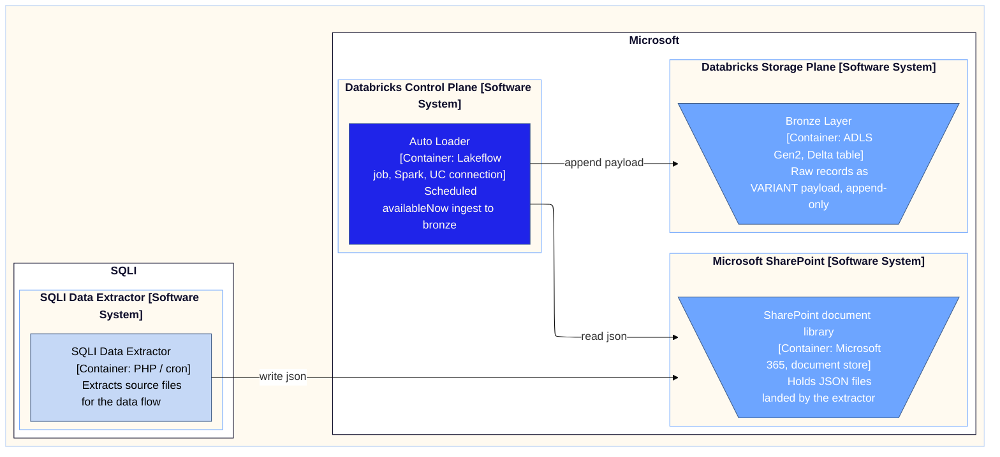

# JSON on SharePoint to Databricks bronze, the temporary landing design

> The build recipe for automating an existing, manually-ingested SharePoint-to-
> Databricks JSON flow as a quick win, while SharePoint is still the landing.
> The temporary-zone instance whose end state is the ADLS play. When SharePoint
> retires and the extractor repoints to ADLS, that sibling governs.
>
> VARIANT and connector claims are tech-verified against Microsoft Learn, last
> re-verified 2026-06-23. One residual gap remains, the singleVariantColumn plus
> databricks.connection composition. See Sources.

## When to trigger

A PHP or cron extractor already writes timestamped JSON files to a SharePoint document library, and today those files are loaded into Databricks by hand. You want a governed scheduled load into bronze as a quick win, knowing SharePoint is a temporary landing that will move to ADLS later. The recognition signal is a working-but-manual setup: the extractor runs, the files arrive, and the only missing piece is the governed, scheduled load.

Concrete examples:

- The originating session: 5 JSON files, 2 to 3 imports per day, names prefixed YYYY-MM-DD-HH-MM, some files regenerated in full and some incremental, loaded manually today.
- Any Databricks shop where a SaaS extractor parks JSON on a SharePoint library and a person runs the ingest notebook on demand.

## Why it matters

The deliverable is a governed, scheduled Databricks pipeline that replaces the manual step, reads JSON straight from SharePoint through a Unity Catalog connection with no intermediate store, lands each record raw as a VARIANT column in bronze, and is built so the later ADLS migration changes only the source path and the trigger configuration.

## From temporary SharePoint to target ADLS

This is a bounded-phase design. Each concern below has a temporary form while SharePoint is the landing and a target form once the flow moves to ADLS. Migration touches only these rows. Everything else carries over unchanged.

### Temp to target map

| Concern | Temporary, SharePoint landing | Target, ADLS end state |
| :--- | :--- | :--- |
| Source access | Standard SharePoint connector through a UC connection. Beta, so a DBR 17.3 LTS runtime floor and a review date | UC External Location on ADLS Gen2, no connector. The DBR 15.3 VARIANT floor governs alone |
| Ingestion trigger | Scheduled job, availableNow, 2 to 3 runs/day. Polls because SharePoint cannot fire a trigger | Native file-arrival trigger on the External Location, with managed file events |
| File routing | Load URL scopes the folder, sub-site, or library, pathGlobFilter narrows by name. Folder-path glob unsupported | Per-type Volume isolation plus folder routing on the External Location |
| Byte-faithful fidelity | Not captured. VARIANT only. Revisit only if an audit obligation appears in this phase | In-row byte-faithful STRING plus a retained landed file, decided up front |

What carries over unchanged: singleVariantColumn to a payload VARIANT, append-only bronze, the 16 MB VARIANT cap, multiLine matched to file shape, immutable uniquely-named files, the single Auto Loader checkpoint with no schemaLocation, the `_source_file` plus `_ingested_at` provenance, and full-refresh versus incremental resolved in silver.

### Migration diff

Only the read-path block changes. The write block is untouched.

```diff
 df = (spark.readStream.format("cloudFiles")
     .option("cloudFiles.format", "json")
-    .option("databricks.connection", "my_sharepoint_conn")
+    .option("cloudFiles.useManagedFileEvents", "true")
     .option("singleVariantColumn", "payload")
     .option("pathGlobFilter", "*-orders.json")
     .option("multiLine", "true")
-    .load("https://<tenant>.sharepoint.com/sites/<site>/<library>/<folder>"))
+    .load("abfss://<container>@<account>.dfs.core.windows.net/<path>"))
```

| Edit | Class |
| :--- | :--- |
| Drop `databricks.connection`, the External Location carries auth | Source |
| Change `.load()` from SharePoint URL to `abfss://` path | Source |
| Add `cloudFiles.useManagedFileEvents=true` | Trigger mechanism |
| Flip the job trigger from scheduled to file-arrival, in job config not code | Trigger |
| `trigger(availableNow=True)`, checkpoint, payload VARIANT, provenance, routing | Unchanged |

Two caveats:

- The trigger swap is not one code line. The `trigger(availableNow=True)` line stays. What moves is the job-level trigger type, set in the job spec rather than the notebook, plus the one managed-file-events option. So the honest version is: swap the source path, reconfigure the trigger from scheduled to file-arrival.
- The residual verification gap dies at migration. The unverified singleVariantColumn plus databricks.connection pairing exists only in the temp state. On ADLS the singleVariantColumn read from an object-store path is the documented pattern. A short SharePoint phase limits exposure to the one unverified composition.

## Flow

A C4 container view of the bronze ingestion path, drawn on the same boundary as the ADLS end-state diagram so the two read as one family. Only the ingestion pattern differs.



The extractor writes timestamped JSON into the SharePoint library and forgets it. On its scheduled run Auto Loader reads, through the Unity Catalog connection, only the files it has not seen, and appends each record to bronze. The two ends never meet. They share nothing but the files in SharePoint, and the Auto Loader checkpoint is the memory that keeps them in sync. At ADLS migration the boundary and the components stay put. Microsoft SharePoint becomes a UC External Location on ADLS Gen2, and the scheduled availableNow qualifier on Auto Loader becomes a native file-arrival trigger.

## The play

### Optimal workflow

1. Confirm SharePoint is temporary, and keep it as the landing for now. Do not pre-stage to ADLS for the quick win.
2. Create a Unity Catalog connection for the standard SharePoint connector using OAuth M2M (app-only, a service principal via an Entra app registration, recommended for automated pipelines), scoped with Sites.Selected or Sites.Read.All for read access. Enable the SharePoint Beta from the workspace Previews page and run on Databricks Runtime 17.3 LTS or above. Set a review date for the Beta dependency.
3. Confirm the file format is JSON up front. One Auto Loader path, no format branching.
4. Land each record as a single VARIANT column with singleVariantColumn, targeting a pre-created bronze table of payload VARIANT plus provenance columns.
5. Enrich each row with the source filename and an ingest timestamp, then append to the bronze Delta table.
6. Run as a scheduled job, 2 to 3 times per day, with the stream in availableNow so each fired run drains and stops. The schedule is the temporary stand-in for the future file-arrival trigger.
7. Scope the read to the target folder, sub-site, or document library via the load URL, then narrow within it with pathGlobFilter on the name. URL folder scoping is supported, only folder-path glob filtering is not.
8. Resolve full-refresh versus incremental files in silver, by deduplication or merge on business key plus load timestamp. Bronze stays append-only. Every produced file must carry a unique name, full-refresh regenerations included, since Auto Loader at the default allowOverwrites=false ingests each path exactly once and will not reload a same-name overwrite.

### Critical moves

| Move | Collapse test |
| :--- | :--- |
| singleVariantColumn to VARIANT, which also removes schema evolution because the variant absorbs drift | Skip it and you fight nested-JSON schema evolution in bronze |
| Reading SharePoint directly through the UC connection, no ADLS hop for the quick win | Skip it and you build a bridge you will delete at migration |
| availableNow scheduled run as the trigger stand-in, over a source-agnostic loader | Skip it and the ADLS migration becomes a rewrite rather than a path-and-trigger swap |
| URL folder scope to select the path, pathGlobFilter on name to narrow within it | Skip it and you over-read a whole library, or assume folder-path globbing the connector does not support |

### Pits to avoid

- Designing for CSV or Excel before confirming the format is JSON.
- Assuming the managed connector cannot read JSON. It can. The standard connector is chosen for output shape and control, not a capability gap. See Tradeoffs.
- Treating VARIANT as byte-faithful. It is a normalised parsed tree, not the original bytes. Key order, insignificant whitespace, and duplicate keys are not preserved.
- The 16 MB VARIANT per-record cap. A record over 16 MB is treated like a corrupt record and lands in corruptRecordColumn under PERMISSIVE, not in the payload.
- Setting multiLine wrong for the file shape. Newline-delimited JSON needs it off, a single object or array per file needs it on.
- Assuming a same-name regenerated file will reload. Auto Loader defaults to allowOverwrites=false and ingests each path exactly once, so a full-refresh file that reuses a name will not reprocess. Keep every file name unique per run, full-refresh regenerations included. Databricks recommends ingesting immutable files only.
- Expecting a file-arrival trigger to watch SharePoint. It sees only Unity-Catalog-governed storage, so the schedule is the only trigger here.
- Expecting cloudFiles.cleanSource to clean up at the source. It is not supported on the standard SharePoint connector, so source-file cleanup or archival at SharePoint stays manual.
- Trying to read more than one site in one query. Multi-site ingestion in a single query is unsupported. One query reads one site, so a second site means a second query and pipeline.
- Running a Beta connector on a production path with no review date set.
- Putting cron or the connection inside a [Container: ...] label in any diagram. Both are trigger or relationship metadata, not containers.

## On the VARIANT type

VARIANT is a single column type holding a whole JSON-like value as a parsed binary structure, queryable in place. Three properties carry this design.

- Parsed, not text. The JSON is decoded once at write time into a typed binary encoding, so "42" and 42 stay distinguishable. It is not the source file byte for byte, which is why VARIANT cannot stand in for a byte-faithful copy.
- Accessed by path, like payload:customer.id with a cast such as ::int, with the parse already done. Path access is case-sensitive, so payload:Field and payload:field differ.
- Schema-flexible. One column absorbs differing and evolving record shapes with no table change, which is why schema evolution drops out of this design.

## When to use it

- The extractor already lands JSON on SharePoint and ingestion is manual today.
- A Unity Catalog workspace on DBR 17.3 LTS or above, with the ability to register an Entra app for OAuth M2M auth.
- Per-record JSON sits under the 16 MB VARIANT cap, format confirmed JSON.
- The temporary landing is accepted, so a Beta connector is tolerable for a bounded phase.

## When not to use it

- The format is not JSON, or is mixed. Re-open the format-path decision first.
- Byte-exact audit or replay is required now. VARIANT is a parsed tree, not the source bytes, so dual-land a STRING column alongside it (which forecloses singleVariantColumn) or move to the ADLS design. Deferred otherwise: revisit only if an audit obligation appears in this phase.
- Records exceed 16 MB. The single VARIANT column rejects them into the corrupt-record column.
- Files are regenerated under the same name and cannot be renamed. Auto Loader will not reload a same-name overwrite at the default allowOverwrites=false. Switch to a unique-name scheme upstream first.
- You would rather not maintain a pipeline. The managed SharePoint connector parses JSON into Delta with managed sync and schema handling, at the cost of the raw single-VARIANT control this design keeps.
- SharePoint is permanent. Go to ADLS plus a file-arrival trigger now and use the sibling play, skipping the Beta connector.
- The SaaS is a supported Lakeflow Connect managed connector. Ingest the SaaS directly and retire both SharePoint and the extractor.

## Expected outcome

| Promise | How to check |
| :--- | :--- |
| The manual ingestion step is replaced by a governed scheduled job | The manual run no longer exists and a scheduled job owns the load |
| Bronze holds payload VARIANT plus provenance, append-only | The table schema is payload VARIANT, source filename, ingest timestamp, and no row is mutated in place |
| Oversized records are surfaced, not lost | Any record over 16 MB appears in the corrupt-record column rather than vanishing from the payload |
| Each produced file is ingested once | File names are unique per run, full-refresh regenerations included, allowOverwrites left at its default false, and the Auto Loader checkpoint lists every produced file as processed |
| The later ADLS migration is confined to source and trigger | The read-path changes match the Migration diff: source path and connection, the managed-file-events option, and the job trigger type. The write block is unchanged |

## Tradeoffs

Decisions ordered by scope. Chosen on the left of the alternative, rationale last.

| Decision | Scope | Chosen | Rejected alternative | Why |
| :--- | :--- | :--- | :--- | :--- |
| Connector variant | Connector | Standard SharePoint connector | Managed connector | Both read JSON into Delta. Standard lands the whole record as one VARIANT with append-only, provenance, full pipeline control and a path-swap-only migration. Chosen for output shape and control, not capability |
| Read path | Connector | Native connector direct read (read_files / Auto Loader) | DIY Graph or ADLS bridge | No intermediate store, and no bridge to delete at migration |
| Raw type | Representation | VARIANT single column | Inferred struct with schema evolution | The variant absorbs drift, so schema evolution drops out |
| Fidelity | Representation | VARIANT only | Byte-exact STRING now | The landing is temporary. Revisit only if an audit obligation appears in this phase |
| Trigger | Triggering | Scheduled poll with availableNow | Native file-arrival | SharePoint cannot fire the native trigger, so the schedule stands in for it |
| Routing | Triggering | URL folder scope plus pathGlobFilter on name | Folder-path glob filter | Folder-path glob is unsupported. URL scopes the read, pathGlobFilter narrows by name |

## Reference implementation

One file pattern maps to one bronze table, each with its own checkpoint. Repeat the block per file, or wrap it in a loop over a list of (glob, table) pairs. The schedule and availableNow mode make this a fire-drain-stop job, not an always-on stream.

PySpark, Auto Loader streaming:

```python
from pyspark.sql.functions import col, current_timestamp

# Pre-create bronze: one VARIANT column plus provenance
spark.sql("""
  CREATE TABLE IF NOT EXISTS bronze.orders_raw (
    payload       VARIANT,
    _source_file  STRING,
    _ingested_at  TIMESTAMP
  )
""")

df = (spark.readStream.format("cloudFiles")
    .option("cloudFiles.format", "json")
    .option("databricks.connection", "my_sharepoint_conn")  # the standard SharePoint connection
    .option("singleVariantColumn", "payload")               # whole record into one VARIANT
    .option("pathGlobFilter", "*-orders.json")              # narrows by name within the URL-scoped path
    .option("multiLine", "true")                            # true for one object/array per file, off for NDJSON
    .load("https://<tenant>.sharepoint.com/sites/<site>/<library>/<folder>"))  # URL scopes the read

out = df.select(
    col("payload"),
    col("_metadata.file_path").alias("_source_file"),
    current_timestamp().alias("_ingested_at"))

(out.writeStream
    .option("checkpointLocation", "<checkpoint-path>/orders")
    .trigger(availableNow=True)        # drain everything new since last run, then stop
    .toTable("bronze.orders_raw"))
```

SQL equivalent, for a Lakeflow declarative pipeline (set "CHANNEL" = "PREVIEW" in pipeline settings while the connector is Beta):

```sql
CREATE OR REFRESH STREAMING TABLE bronze.orders_raw AS
SELECT *, _metadata.file_path AS _source_file, current_timestamp() AS _ingested_at
FROM STREAM read_files(
  'https://<tenant>.sharepoint.com/sites/<site>/<library>/<folder>',
  `databricks.connection` => 'my_sharepoint_conn',
  format              => 'json',
  singleVariantColumn => 'payload',
  pathGlobFilter      => '*-orders.json',
  multiLine           => true);
```

Notes:

- With singleVariantColumn there is no schema to infer, so no schemaLocation is needed. The checkpointLocation alone tracks which files have been processed. The official singleVariantColumn examples confirm this, using checkpointLocation only.
- Point .load() at the specific folder, sub-site, or library. The URL scopes the read. pathGlobFilter narrows by name within it. Folder-path glob filtering is unsupported.
- Set multiLine to match the file shape. Newline-delimited JSON needs it off, a single object or array per file needs it on.
- Each record must stay under the 16 MB VARIANT cap. Oversized records land in corruptRecordColumn under PERMISSIVE.
- Keep file names unique per run. Auto Loader at the default allowOverwrites=false ingests each path exactly once and will not reload a same-name overwrite.
- cloudFiles.cleanSource is not supported on this connector, so source cleanup at SharePoint is manual.
- Combining singleVariantColumn with databricks.connection is the logical composition but is not shown together in an official example. The official singleVariantColumn examples read from a UC Volume or object-store path, not a SharePoint connection. The VARIANT page also shows .schema("payload VARIANT") as an alternative whole-record route worth including in the test. Test on one file before committing (see Sources).

## Sources

Load-bearing claims mapped to source. Connector and VARIANT claims were fetched
and verified against Microsoft Learn on 2026-06-13, re-verified 2026-06-21, and
the SharePoint connector, VARIANT, and file-arrival trigger pages re-fetched
2026-06-23 (SharePoint standard and managed connector pages, VARIANT page, Auto
Loader FAQ, file-arrival triggers page). The ingestion-overview source [9] is
carried from the options doc (2026-06-09-adls-bronze-ingestion-design-options.md,
v1.4).

| Claim in this play | Source |
| :--- | :--- |
| Standard SharePoint connector via databricks.connection with read_files, Auto Loader, spark.read and COPY INTO, Beta status, DBR 17.3 LTS floor, URL folder scope (site, sub-site, library, folder, file), pathGlobFilter on name, folder-path glob unsupported, no multi-site per query, cleanSource unsupported | [13] |
| Managed SharePoint connector parses structured formats (CSV, JSON, XML, Excel) into Delta tables, plus binary and metadata-only modes, with incremental ingestion, schema evolution, Unity Catalog governance and OAuth M2M | [15] |
| OAuth M2M recommended for automated pipelines (app-only, service principal), Sites.Selected or Sites.Read.All scope | [14] |
| VARIANT type, JSON from DBR 15.3, singleVariantColumn whole-record ingest, 16 MB record cap, oversized and malformed records to corruptRecordColumn under PERMISSIVE, whole-record VARIANT disables schema evolution and rescuedDataColumn, maintains case sensitivity | [11] |
| VARIANT is a normalised parsed tree not the original bytes, and path access is case-sensitive | [11][12] |
| Auto Loader checkpoint (RocksDB) gives exactly-once ingestion, resumes from the last checkpoint, no manual state | [10] |
| Default allowOverwrites=false processes each file path exactly once, a same-name overwrite is not reliably reprocessed, immutable files recommended | [F-AL] |
| Scheduled Trigger.AvailableNow for regular-interval arrivals, run after the anticipated arrival time, AvailableNow from DBR 10.4 LTS | [F-AL] |
| Auto Loader cloudFiles detection modes, checkpoint independent of mode | [6] |
| Databricks managed ingestion and Lakeflow Connect managed connectors, the basis for retiring the extractor when a connector covers the source | [9] |
| Native file-arrival trigger requires a UC external location or volume, recommends managed file events, so SharePoint via the connector cannot fire it | [7] |

> ⚠️ Unverified, residual. Confirm before Final:
> - singleVariantColumn combined with databricks.connection in one read. JSON ingestion via Auto Loader on the standard connector is documented, but the whole-record VARIANT composition is not shown in an official example, and every official singleVariantColumn example reads from a Volume or object-store path. Test on one file first.

Source URLs:

- [6] https://learn.microsoft.com/en-us/azure/databricks/ingestion/cloud-object-storage/auto-loader/file-detection-modes
- [7] https://learn.microsoft.com/en-us/azure/databricks/jobs/file-arrival-triggers
- [9] https://learn.microsoft.com/en-us/azure/databricks/ingestion/
- [10] https://learn.microsoft.com/en-us/azure/databricks/ingestion/cloud-object-storage/auto-loader/production
- [11] https://learn.microsoft.com/en-us/azure/databricks/ingestion/variant
- [12] https://learn.microsoft.com/en-us/azure/databricks/semi-structured/variant-json-diff
- [13] https://learn.microsoft.com/en-us/azure/databricks/ingestion/sharepoint
- [14] https://learn.microsoft.com/en-us/azure/databricks/ingestion/lakeflow-connect/sharepoint-source-setup-overview
- [15] https://learn.microsoft.com/en-us/azure/databricks/ingestion/lakeflow-connect/sharepoint
- [F-AL] https://learn.microsoft.com/en-us/azure/databricks/ingestion/cloud-object-storage/auto-loader/faq

## Version block

| Field | Value |
| :--- | :--- |
| Version | 2.8 |
| Last Updated | 2026-06-23 |
| Status | Draft |
| Pairs with | 2026-06-02-json-adls-to-bronze-ingestion-play.md, 2026-06-02-temporary-landing-zone-bronze-ingestion-play.md |
