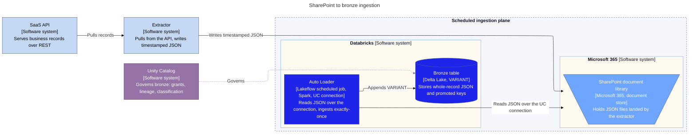

# SharePoint to bronze ingestion: locked design

> Scheduled ingestion of JSON from a SharePoint document library into a bronze
> Delta table. Locked on the standard SharePoint connector through a Unity
> Catalog connection, with a scheduled `Trigger.availableNow` drain.
> Pairs with 2026-06-13-sharpoint-to-bronze-ingestion-play.md (the full build recipe)
> and 2026-06-24-adls-bronze-ingestion-design-lock-in.md (the target end state).

This document is the locked design for the temporary SharePoint landing phase. The build recipe that produced it lives in the paired play and is not repeated here. All technical claims are carried from that play (v2.8), verified against Microsoft Learn on 2026-06-23, and were not re-fetched in this session. One residual composition stays unverified and blocks promotion to Final, see the Locked decision and Standing checks.

## Locked decision

The ingestion path is the standard SharePoint connector read directly through a Unity Catalog connection, with no intermediate store. Auto Loader lands each record as a single VARIANT column and appends to a bronze Delta table. The run is launched by the Lakeflow job clock on a fixed cadence, 2 to 3 times per day, and drains with `Trigger.availableNow`. This is scheduled launch plus batch drain: SharePoint cannot fire a native file-arrival trigger, so the schedule stands in for it. The schedule is the only trigger here.

This is a bounded-phase design, a disposable bridge. SharePoint is the temporary landing. When it retires and the extractor repoints to ADLS Gen2, the sibling lock-in governs and the migration changes only the source path and the trigger. See the Temporary by design section.

Four facts underpin the decision:

- The standard connector is chosen for output shape and control, not a capability gap. Both the standard and the managed SharePoint connector read JSON into Delta. The standard one lands the whole record as one VARIANT, append-only, with provenance and full pipeline control, and a path-swap-only migration. The managed connector is rejected because it parses into its own schema and forecloses the single-VARIANT route [6][8].
- The connector is Beta. It runs on a Databricks Runtime 17.3 LTS floor and carries a review date. Auth is OAuth M2M, an app-only service principal via an Entra app registration, scoped Sites.Selected or Sites.Read.All [6][7].
- One residual composition is unverified: `singleVariantColumn` combined with `databricks.connection` in a single read. JSON ingestion via Auto Loader on the standard connector is documented, but the whole-record VARIANT composition is not shown together in an official example, and every official `singleVariantColumn` example reads from a Volume or object-store path [4][6]. This must pass a one-file empirical test before Final.
- Auto Loader gives exactly-once via the RocksDB checkpoint. With `singleVariantColumn` there is no schema to infer, so no `schemaLocation` is needed, the checkpoint alone tracks processed files [3][4].

> ⚠️ Unverified, residual. Confirm before Final: `singleVariantColumn` + `databricks.connection` in one read. Test on one file first. This gap dies at ADLS migration, where `singleVariantColumn` from an object-store path is the documented pattern.

## Solution benchmark

The locked solution scored against the platform selection criteria, same criteria and weights as the ADLS sibling so the two totals compare directly. Ratings are 1 to 5 on how well it satisfies each criterion (5 best), weighted by the platform criterion weight. The ratings are derived from the play tradeoffs for this lock-in, confirm they match the current platform criteria before citing as alignment evidence.

| # | Criterion | Weight | Rating | Weighted | Rationale |
| :--- | :--- | ---: | ---: | ---: | :--- |
| 1 | Compute cost impact | 5 | 4 | 20 | Scheduled availableNow drains and stops, so no idle compute. It polls on a fixed cadence rather than on arrival, so a run can fire with nothing new |
| 2 | Latency, event to bronze | 3 | 2 | 6 | No event path exists on SharePoint, so latency is bounded by the poll interval, hours between runs, not minutes |
| 3 | Scale ceiling and limits | 3 | 2 | 6 | List-based discovery over a Beta connector, one query reads one site, no multi-site per query, no managed queue |
| 4 | Operational ownership | 5 | 4 | 20 | One scheduled job, one connection, no self-operated infra. Source cleanup stays manual (cleanSource unsupported) and the Beta review date must be tracked |
| 5 | Ingestion guarantee | 5 | 5 | 25 | Auto Loader exactly-once via the RocksDB checkpoint, resumable on restart, same engine as the ADLS path |
| 6 | Maturity and longevity | 3 | 2 | 6 | The connector is Beta on a DBR 17.3 LTS floor, and the design is deliberately temporary and disposable |
| 7 | Source format coverage | 2 | 4 | 8 | Reads JSON through the standard reader, whole-record VARIANT absorbs schema drift |
| 8 | Security surface and access governance | 5 | 4 | 20 | Reads inside the governed plane on an OAuth M2M service principal, no intermediate store. Lowered by the Beta connector and the one unverified composition |
| 9 | GDPR and data protection | 3 | 4 | 12 | Inherits Unity Catalog lineage, classification and governed access |
| | Total (max 170) | | | 123 | |

Verdict: the locked configuration is the right call for a bounded quick win while SharePoint is the landing, not a permanent target. It matches the ADLS sibling on ingestion guarantee and format coverage, leads on operational ownership, and trades latency, scale and maturity for speed of delivery, scoring 123 against the sibling 151. The schedule cadence and the bronze freshness target set the run frequency. The configuration finalises once the residual VARIANT plus connection composition is verified empirically.

## Temporary by design: migration to ADLS

Each concern below has a temporary form while SharePoint is the landing and a target form once the flow moves to ADLS. Migration touches only these rows. Everything else carries over unchanged.

| Concern | Temporary, SharePoint landing | Target, ADLS end state |
| :--- | :--- | :--- |
| Source access | Standard SharePoint connector through a UC connection. Beta, so a DBR 17.3 LTS floor and a review date | UC external location on ADLS Gen2, no connector. The DBR 15.3 VARIANT floor governs alone |
| Ingestion trigger | Scheduled job, availableNow, 2 to 3 runs/day. Polls because SharePoint cannot fire a trigger | Native file-arrival trigger on the external location, with managed file events |
| File routing | Load URL scopes the folder, sub-site or library, pathGlobFilter narrows by name. Folder-path glob unsupported | Per-type volume isolation plus folder routing on the external location |
| Byte-faithful fidelity | Not captured. VARIANT only. Revisit only if an audit obligation appears in this phase | In-row byte-faithful STRING plus a retained landed file, decided up front |

What carries over unchanged: `singleVariantColumn` to a payload VARIANT, append-only bronze, the 16 MB VARIANT cap, `multiLine` matched to file shape, immutable uniquely-named files, the single Auto Loader checkpoint with no `schemaLocation`, the `_source_file` plus `_ingested_at` provenance, and full-refresh versus incremental resolved in silver.

Only the read-path block changes at migration. The write block is untouched.

```diff
 df = (spark.readStream.format("cloudFiles")
     .option("cloudFiles.format", "json")
-    .option("databricks.connection", "my_sharepoint_conn")
+    .option("cloudFiles.useManagedFileEvents", "true")
     .option("singleVariantColumn", "payload")
     .option("pathGlobFilter", "*-orders.json")
     .option("multiLine", "true")
-    .load("https://<tenant>.sharepoint.com/sites/<site>/<library>/<folder>"))
+    .load("abfss://<container>@<account>.dfs.core.windows.net/<path>"))
```

| Edit | Class |
| :--- | :--- |
| Drop `databricks.connection`, the external location carries auth | Source |
| Change `.load()` from SharePoint URL to `abfss://` path | Source |
| Add `cloudFiles.useManagedFileEvents=true` | Trigger mechanism |
| Flip the job trigger from scheduled to file-arrival, in job config not code | Trigger |
| `trigger(availableNow=True)`, checkpoint, payload VARIANT, provenance, routing | Unchanged |

Two caveats carry from the play. The trigger swap is not one code line: the `trigger(availableNow=True)` line stays, what moves is the job-level trigger type set in the job spec, plus the one managed-file-events option. And the residual verification gap dies at migration, since on ADLS the `singleVariantColumn` read from an object-store path is the documented pattern. A short SharePoint phase limits exposure to the one unverified composition.

## Diagram



Notation. The diagram is a C4 container view of the system in focus, SharePoint to bronze ingestion (the title), drawn on the same boundary as the ADLS end-state diagram so the two read as one family. The dashed outer boundary is the sub-system boundary, Scheduled ingestion plane. Inside it sit two software systems drawn as boundaries, Microsoft 365 and Databricks, each holding its containers. Containers carry three lines: name, technology in brackets, then a function starting with a verb. Shape encodes container kind. A box is an application or service (Auto Loader). A cylinder is a datastore (bronze Delta table). A trapezoid is a document store (SharePoint library). The three black-box nodes outside the boundary (SaaS API, Extractor, Unity Catalog) are external software systems carrying name, [Software system], then a function, the supporting elements the in-scope containers connect to. Relationships read source to destination with an active verb, following the Structurizr relationship convention. The mauve dashed edge is the governance dependency, Unity Catalog governs bronze. Colour follows the Elevate palette: electric blue for the containers this design specialises (Auto Loader, bronze), sky blue for the SharePoint document store, ice blue for the external source systems (SaaS API, Extractor), and mauve for Unity Catalog as the governance system.

There is no eventing surface on this diagram, and that absence is the point. SharePoint emits no storage events Databricks can subscribe to, so there is no Event Grid topic, no notification queue, and no file events service. The launch trigger is the Lakeflow job clock, internal to the Auto Loader job, which is why it is not a separate node, putting the schedule or the connection in a container label would mistake trigger metadata for a container. Discovery is list-based: on each scheduled run Auto Loader lists the URL-scoped path and ingests only files its checkpoint has not seen.

## Design steps

| Design step | Technical elements | Benefits | Watch-outs | Sources |
| :--- | :--- | :--- | :--- | :--- |
| 1. Extract from SaaS source | External extractor (already running), PHP or cron, SaaS REST client, emits timestamped JSON, unique filenames | Decoupled from Databricks, owns SaaS auth and pagination | Scheduling and retry are the extractor's, no native exactly-once upstream | [2] |
| 2. Land file to SharePoint | SharePoint document library (Microsoft 365), extractor writes via its own path, names prefixed YYYY-MM-DD-HH-MM | Working-but-manual setup already in place, no new landing infra | Same-name overwrite does not reload at allowOverwrites=false (check 4). cloudFiles.cleanSource unsupported, so source cleanup stays manual (check 8) | [6][9] |
| 3. Connect, UC connection to SharePoint | Standard SharePoint connector, databricks.connection, OAuth M2M service principal via Entra app, Sites.Selected or Sites.Read.All, Beta, DBR 17.3 LTS floor | Governed read inside Unity Catalog, no intermediate store, full output-shape control | Beta connector, set a review date. One query reads one site, multi-site per query unsupported | [6][7] |
| 4. Discover and ingest, scheduled Auto Loader poll | Auto Loader stream, cloudFiles.format=json, singleVariantColumn, URL folder scope, pathGlobFilter on name, multiLine matched to file shape, Trigger.availableNow, scheduled 2 to 3 runs/day, RocksDB checkpoint exactly-once, no schemaLocation | Fire-drain-stop job, no idle compute, source-agnostic loader so migration is a path-and-trigger swap | List-based discovery, no file events. Folder-path glob unsupported, URL scopes the read. The residual singleVariantColumn + databricks.connection composition is unverified (check 2) | [1][3][4][6][9] |
| 5. Write to bronze as VARIANT | Delta bronze table, singleVariantColumn whole-record VARIANT (DBR 15.3+), provenance _source_file and _ingested_at, append-only, full-refresh vs incremental resolved in silver | Schema-flexible semi-structured storage, schema evolution drops out, queryable in place | VARIANT is a parsed tree not the source bytes. 16 MB record cap to corruptRecordColumn under PERMISSIVE. Path access case-sensitive. Public Preview (check 6) | [4][5] |

## Component inventory

Container technology and ownership for each component. The Auto Loader checkpoint is listed for completeness though it is not a separate node on the diagram. "Owned by" is who provisions and operates the component.

| Component | Container technology | Owned by |
| :--- | :--- | :--- |
| Extractor | External SaaS REST client, PHP or cron, emits timestamped JSON | You, external to Databricks |
| SharePoint document library | Microsoft 365 document store, read over the standard connector | You, Microsoft 365 tenant |
| UC connection to SharePoint | Unity Catalog connection, standard SharePoint connector, OAuth M2M service principal | You, Unity Catalog governed |
| Auto Loader | Lakeflow scheduled job running Spark Structured Streaming (`cloudFiles`), Trigger.availableNow drain | You configure the job, Databricks runs the runtime |
| Auto Loader checkpoint | RocksDB state store in the checkpoint location, holds read position and processed-file set | You, on durable storage you choose |
| Bronze table | Delta Lake table, single VARIANT column plus promoted typed columns | You, governed by Unity Catalog |
| Unity Catalog | Account-level governance metastore, one per region, attached to workspaces | Databricks account admin |

## Implementation notes

These refine the diagram and steps above and do not replace the standing checks below.

1. Discovery is list-based, there is no notification path. On each scheduled run Auto Loader lists the URL-scoped SharePoint path and, using the read position in its checkpoint, ingests only files it has not seen. There is no Event Grid subscription, no queue and no file events service, because SharePoint emits no storage events to Databricks. The schedule is the sole trigger.
2. The checkpoint is the memory that keeps the two ends in sync. The extractor writes and forgets, Auto Loader reads on its schedule, and they share nothing but the files in SharePoint. Keep the checkpoint location durable and unique per stream. With `singleVariantColumn` there is no schema to infer, so the checkpoint alone tracks processed files, no `schemaLocation` is needed.
3. One file pattern maps to one bronze table, each with its own checkpoint. Repeat the read-and-write block per file pattern, or loop over a list of (glob, table) pairs.
4. Point `.load()` at the specific folder, sub-site or library. The URL scopes the read, `pathGlobFilter` narrows by name within it. Folder-path glob filtering is unsupported on the connector.
5. Set `multiLine` to match the file shape. Newline-delimited JSON needs it off, a single object or array per file needs it on.
6. Unity Catalog is account-level, not a workspace component. One metastore per region, attached to workspaces. Configure grants, lineage and classification at the catalog, schema and table level, not as part of the ingestion job. Do not model it inside the Databricks workspace boundary.

## Standing checks before a production commitment

Items 1 to 9 are runtime and ingestion checks. Items 10 to 11 are the security baseline, which applies regardless of the design.

1. Confirm the target workspace runs DBR 17.3 LTS or above and enable the SharePoint Beta from the workspace Previews page. Set a review date for the Beta dependency, and do not run a Beta connector on a production path without one.
2. Verify the `singleVariantColumn` plus `databricks.connection` composition empirically on one file before promoting this design to Final. This is the one residual gap. The VARIANT page `.schema("payload VARIANT")` alternative is worth including in the same test. Until this passes, the design stays Draft.
3. Confirm the file format is JSON up front. One Auto Loader path, no format branching.
4. Keep every produced file uniquely named per run, full-refresh regenerations included. Auto Loader at the default `allowOverwrites=false` ingests each path exactly once and will not reload a same-name overwrite.
5. Set `multiLine` to match the file shape, off for NDJSON, on for a single object or array per file.
6. Treat the VARIANT bronze write as Public Preview. Promote any key used for partition, clustering, filter, join, group or order into a typed column, and match field casing exactly, since path access is case-sensitive. Records over 16 MB land in `corruptRecordColumn` under PERMISSIVE, not in the payload.
7. Scope discovery with the load URL on the folder, sub-site or library, then narrow with `pathGlobFilter` on the name. One query reads one site, a second site means a second query and pipeline.
8. Source cleanup at SharePoint stays manual. `cloudFiles.cleanSource` is not supported on the standard connector.
9. Resolve full-refresh versus incremental files in silver, by deduplication or merge on business key plus load timestamp. Bronze stays append-only.
10. Use OAuth M2M, an app-only service principal via an Entra app, scoped Sites.Selected or Sites.Read.All. Lock SharePoint library write access to the extractor identity alone.
11. Keep the ingest idempotent so a duplicate or replayed file cannot double-count. Validate content before the write into bronze, size and type limits, and quarantine anomalies.

## Glossary

Scoped to the concepts this design uses.

| Term | Meaning |
| :--- | :--- |
| Standard SharePoint connector | The Databricks connector that reads SharePoint through a `databricks.connection` with `read_files`, Auto Loader, `spark.read` and COPY INTO. Beta, DBR 17.3 LTS floor. Chosen for whole-record VARIANT output and full pipeline control |
| Managed SharePoint connector | The Lakeflow Connect connector that parses CSV, JSON, XML and Excel into Delta with managed sync and schema handling. Rejected here because it forecloses the single-VARIANT route |
| databricks.connection | The Auto Loader option naming the Unity Catalog connection that carries SharePoint auth and access |
| OAuth M2M | App-only machine-to-machine auth, a service principal via an Entra app registration, recommended for automated pipelines |
| Sites.Selected / Sites.Read.All | The Microsoft Graph permission scopes granting the service principal read access to SharePoint sites |
| List-based discovery | Auto Loader lists the URL-scoped path on each run and ingests unseen files. The only discovery mode available on SharePoint, since no storage events are emitted |
| Lakeflow job | The Databricks job that runs the Auto Loader stream, launched here by the job clock on a fixed schedule |
| Trigger.availableNow | A batch trigger that processes all files present at start, then stops. The locked drain mode, launched by the job schedule |
| File-arrival trigger | A Lakeflow trigger that launches on new files in a UC external location or volume. Not available here, SharePoint via the connector cannot fire it, which is why the schedule is the trigger |
| URL folder scope | Pointing `.load()` at a folder, sub-site or library URL to scope the read. Folder-path glob filtering is unsupported |
| pathGlobFilter | The Auto Loader option that narrows by filename within the URL-scoped path |
| multiLine | The Auto Loader option matched to file shape, off for newline-delimited JSON, on for a single object or array per file |
| VARIANT | The semi-structured column type (DBR 15.3+, Public Preview) holding the whole JSON record as a parsed binary tree, not the source bytes. Path access is case-sensitive |
| singleVariantColumn | The Auto Loader option that ingests the whole record into one VARIANT column, which also removes schema evolution |
| corruptRecordColumn | The column that captures malformed or oversized (>16 MB) records under PERMISSIVE mode |
| allowOverwrites | The Auto Loader option, default false, that makes each path ingest exactly once, so a same-name overwrite does not reload |
| cloudFiles.cleanSource | The Auto Loader source-cleanup option, unsupported on the standard SharePoint connector, so cleanup stays manual |
| Checkpoint (RocksDB) | The Auto Loader state store tracking discovered files, giving exactly-once and resume-on-restart |
| Promoted columns | Typed columns extracted alongside the VARIANT (`_source_file`, `_ingested_at`, business key) for keys used to filter, join, cluster or partition |

## Official sources

All claims carried from the paired play (v2.8), verified against Microsoft Learn on 2026-06-23, not re-fetched this session. Numbered sequentially for this document, the play's own reference numbers do not carry over.

| Ref | Topic | Link |
| :--- | :--- | :--- |
| 1 | Auto Loader file detection modes | [learn.microsoft.com](https://learn.microsoft.com/en-us/azure/databricks/ingestion/cloud-object-storage/auto-loader/file-detection-modes) |
| 2 | Standard connectors in Lakeflow Connect | [learn.microsoft.com](https://learn.microsoft.com/en-us/azure/databricks/ingestion/) |
| 3 | Configure Auto Loader for production | [learn.microsoft.com](https://learn.microsoft.com/en-us/azure/databricks/ingestion/cloud-object-storage/auto-loader/production) |
| 4 | Ingest data as variant | [learn.microsoft.com](https://learn.microsoft.com/en-us/azure/databricks/ingestion/variant) |
| 5 | Variant versus JSON strings | [learn.microsoft.com](https://learn.microsoft.com/en-us/azure/databricks/semi-structured/variant-json-diff) |
| 6 | SharePoint standard connector | [learn.microsoft.com](https://learn.microsoft.com/en-us/azure/databricks/ingestion/sharepoint) |
| 7 | SharePoint source setup overview | [learn.microsoft.com](https://learn.microsoft.com/en-us/azure/databricks/ingestion/lakeflow-connect/sharepoint-source-setup-overview) |
| 8 | SharePoint managed connector | [learn.microsoft.com](https://learn.microsoft.com/en-us/azure/databricks/ingestion/lakeflow-connect/sharepoint) |
| 9 | Auto Loader FAQ | [learn.microsoft.com](https://learn.microsoft.com/en-us/azure/databricks/ingestion/cloud-object-storage/auto-loader/faq) |

> ⚠️ Unverified, residual. Confirm before Final: `singleVariantColumn` combined with `databricks.connection` in one read. JSON ingestion via Auto Loader on the standard connector is documented, but the whole-record VARIANT composition is not shown in an official example, and every official `singleVariantColumn` example reads from a Volume or object-store path. Test on one file first.

---

| Field | Value |
| :--- | :--- |
| Version | 1.2 |
| Last Updated | 2026-06-24 |
| Status | Draft |
| Pairs with | 2026-06-13-sharpoint-to-bronze-ingestion-play.md, 2026-06-24-adls-bronze-ingestion-design-lock-in.md |
