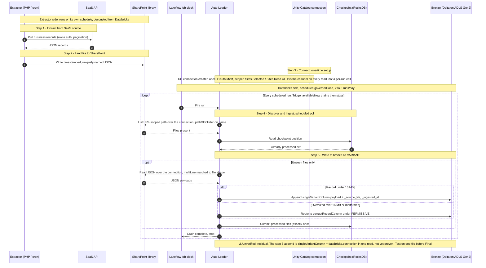

# SharePoint to bronze ingestion: workflow sequence

> Runtime ordering of the five design steps from the locked SharePoint-to-bronze
> design. Complements the C4 container view with the call sequence and the
> decoupling between the extractor and Auto Loader.
> Pairs with 2026-06-24-sharepoint-to-bronze-ingestion-lock-in.md (the locked design)
> and 2026-06-13-sharpoint-to-bronze-ingestion-play.md (the build recipe).

This view shows the same five steps as the lock-in Design steps table, in execution order. The extractor side (steps 1 to 2) runs on its own schedule and shares nothing with Databricks but the files in SharePoint. The Databricks side (steps 3 to 5) runs on the Lakeflow job clock, 2 to 3 times per day, and drains with `Trigger.availableNow`.

## Sequence

## Reading the diagram

- Steps 1 and 2 sit outside the loop. The extractor writes and forgets on its own cadence, so they are not driven by the Databricks schedule.
- Step 3 is one-time setup, also outside the loop. The UC connection is created once and then acts as the channel for every read. It is not a per-run handshake, which is why the reads in steps 4 and 5 go to SharePoint "over the connection" rather than round-tripping to a UC lifeline.
- Steps 4 and 5 sit inside the loop because they repeat on every scheduled run. The `opt` block reflects that a run can fire with nothing new, in which case nothing is appended.
- Step 5 carries an `alt` for fidelity: records under 16 MB land in the VARIANT payload, oversized or malformed records route to `corruptRecordColumn` under PERMISSIVE, so nothing is silently lost.
- Solid arrows are calls, dotted arrows are returns or acknowledgements.
- The checkpoint is drawn as a participant even though it is not a node on the C4 container view, because the exactly-once guarantee in steps 4 to 5 turns on it.
- The final note marks the one residual gap: the step 5 append is the unverified `singleVariantColumn` plus `databricks.connection` composition, which keeps this design at Draft until proven on one file.

## Step mapping

Steps correspond one-to-one to the lock-in Design steps table.

| Step | Sequence action | Lock-in source refs |
| :--- | :--- | :--- |
| 1. Extract from SaaS source | Extractor pulls records, receives JSON | [2] |
| 2. Land file to SharePoint | Extractor writes timestamped JSON to the library | [6][9] |
| 3. Connect, UC connection to SharePoint | UC connection created once, OAuth M2M, then used as the channel on every read | [6][7] |
| 4. Discover and ingest, scheduled poll | Job clock fires, Auto Loader lists the URL-scoped path over the connection, checks the checkpoint | [1][3][4][6][9][10] |
| 5. Write to bronze as VARIANT | Append `singleVariantColumn` payload plus provenance, or route oversized and malformed records to `corruptRecordColumn`, then commit the checkpoint | [4][5] |

Source numbering follows the lock-in design document.

---

| Field | Value |
| :--- | :--- |
| Version | 1.1 |
| Last Updated | 2026-06-25 |
| Status | Draft |
| Pairs with | 2026-06-24-sharepoint-to-bronze-ingestion-lock-in.md, 2026-06-13-sharpoint-to-bronze-ingestion-play.md |
