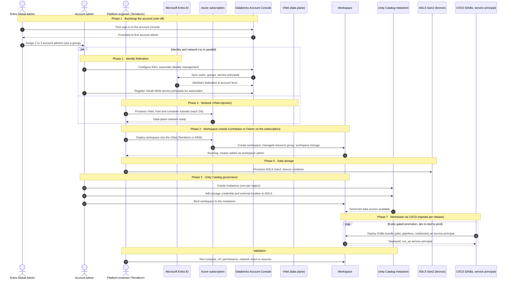

# Databricks infra setup: provisioning sequence

> Order of operations to stand up an Azure Databricks platform, framed on the
> four questions: from where, where to, by whom, when. Grounded on the Microsoft
> Learn production planning guide (10 phases) and the workspace creation and
> account/identity pages.
> Pairs with 2026-06-24-databricks-cicd-promotion-play-DRAFT.md (the workload
> promotion side, Phase 7) and the o2 SAD environment-strategy block.

The account and workspace layers are set up by different identities. Account-level work (identity federation, metastore, workspace creation) is the account admin's. Subscription-level work (network, storage, the workspace resource itself) needs Azure Contributor or Owner and falls to the platform engineer. Identity and network are independent, so they run in parallel. Workloads land later, repeatedly, through CI/CD.

## Sequence

## Reading the diagram

- The `par` block is the key ordering claim. Identity federation and network are independent, so the guide allows them in parallel. Everything after the block depends on at least one of them.
- The bootstrap step (1 to 3) is one-off. The Entra Global Admin role is needed only for the very first account-console login, then the role becomes account admin and the Global Admin grant can be dropped.
- The workspace step needs a subscription-level role (Contributor or Owner), which is why it is the platform engineer's, not the account admin's.
- The CI/CD `loop` is the only repeating part. Account and workspace infra is set up once per environment, workloads promote continuously. That loop is the subject of the separate CI/CD promotion play.

## From where, where to, by whom, when

| Step | From where | Where to | By whom | When |
| :--- | :--- | :--- | :--- | :--- |
| Bootstrap account admin | Account console | Databricks account | Entra Global Admin | One-off, first login only |
| Identity federation, SSO, SCIM | Account console | Entra ID and account | Account admin | Early, parallel with network |
| VNet and subnets | Terraform on the subscription | Azure data plane | Platform engineer | Parallel with identity |
| Workspace | Terraform or ARM | Azure managed RG | Platform engineer (Contributor or Owner) | After network |
| ADLS Gen2 bronze | Terraform | Azure storage | Platform engineer | After or with workspace |
| Unity Catalog metastore | Account console or Terraform | Account, bound to workspace | Account admin | After workspace and storage |
| Workload deploy (DABs) | CI/CD runner | Workspace | Service principal (OAuth M2M) | Repeats per release |

## When strategy

The guide gives three execution modes, pick by situation.

- Sequential, for greenfield. Walk the phases in order.
- Parallel, for independent phases like network and identity (shown in the `par` block).
- Iterative, when you revisit phases to add workspaces or expand to a new region. The metastore is one per region, so a new region re-enters at Phase 3.

## Sources

Verified against Microsoft Learn, fetched 2026-06-25, pages updated March to June 2026.

- Production planning, 10 phases and design-to-implementation: https://learn.microsoft.com/en-us/azure/databricks/lakehouse-architecture/deployment-guide/
- Phase 1, account and identity, admin roles, first-login bootstrap, automatic identity management: https://learn.microsoft.com/en-us/azure/databricks/lakehouse-architecture/deployment-guide/account-setup
- Workspace creation, Azure roles, managed resource group: https://learn.microsoft.com/en-us/azure/databricks/admin/workspace/create-workspace
- VNet injection, host and container subnets at /26: https://learn.microsoft.com/en-us/azure/databricks/security/network/classic/vnet-inject
- Mermaid sequence diagram syntax: https://mermaid.js.org/syntax/sequenceDiagram.html

<!--
Version: 1.0 | Last Updated: 2026-06-25 | Status: Draft
-->
