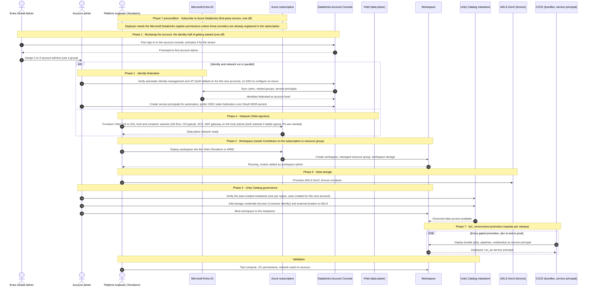

# Databricks infra setup: provisioning sequence

> Order of operations to stand up an Azure Databricks platform, framed on the
> four questions: from where, where to, by whom, when. Grounded on the Microsoft
> Learn production planning guide (10 phases) and the workspace creation and
> account/identity pages.
> Pairs with ../202606-env-setup/2026-06-24-databricks-cicd-promotion-play-DRAFT.md
> (the workload promotion side, Phase 7), 2026-08-10-databricks-cicd-service-principal.md
> (the CI/CD identity) and the o2 SAD environment-strategy material.
> 🔲 To be defined — the SAD environment-strategy section has no artefact of that
> name; nearest is ../2606-o2-architecture-design/2026-06-13-sad-stakeholder-note-first-sessions.md.

The account and workspace layers are set up by different identities. Account-level work (identity federation and Unity Catalog metastore governance) is the account admin's. Subscription-level work (network, storage, and the workspace resource itself) needs Contributor on the subscription or resource group and falls to the platform engineer. Identity and network are independent, so they run in parallel. Workloads land later, repeatedly, through CI/CD. Because this subscription has never run Databricks, it must first be onboarded to the first-party service. The guide has no Phase 0: it places subscribing inside Phase 7 as the step before any automation or workspace creation, so this document treats it as a Phase 7 precondition. The deploying identity needs the Microsoft.Databricks register permissions unless those providers are already registered in the subscription, so the real one-off gate is an Entra Global Admin activating the account console, which is required to use Unity Catalog.

## Sequence

## Reading the diagram

- The `par` block is the key ordering claim. Identity federation and network are independent, so the guide allows them in parallel. Everything after the block depends on at least one of them.
- Subscribing and the bootstrap are one-off. The guide numbers its phases 1 to 10 and treats subscribing as the first step inside Phase 7, so the precondition label here is this document's framing, not the guide's. On Azure there is no separate Databricks contract to sign, it is a first-party service billed through the subscription. On the provider, the docs state only that the `register/action` permissions are not required if those providers are already registered in the subscription, so plan for the deploying identity to hold them and do not rely on a documented auto-registration step. Either way the real gate is the account-console activation: an Entra Global Admin signs in once to activate it, which is required to use Unity Catalog. After that first login the role becomes account admin and the Global Admin grant can be dropped.
- The workspace step needs Contributor access on the subscription or resource group, plus Network Contributor on the VNet for VNet injection, which is why it is the platform engineer's, not the account admin's. Creating the workspace adds the creator's account as a workspace admin outright. Separately, anyone holding subscription-level Contributor or Owner who did not create it still gains workspace admin on first login and keeps it after that Azure role is removed, so subscription Contributor belongs on the list of Databricks admin surfaces to audit.
- This is a classic workspace deployed by VNet injection, which is a deliberate choice against the guide's default. Phase 2 now recommends starting with serverless workspaces and switching to classic only for specific network or compliance requirements, and the workspace creation page warns that classic creation with a Databricks-managed VNet will be deprecated, pointing to serverless or VNet injection. VNet injection is the supported classic route, so this sequence is on a current path, chosen for network control over the data plane.
- Secure cluster connectivity (SCC) is the default posture for classic compute. Under SCC both subnets are private and all compute-to-control-plane traffic is outbound, which is why a new VNet after 31 March 2026 (when new Azure VNets default to no outbound internet) needs an explicit egress path: a NAT gateway on the host subnet. The docs are inconsistent here. Phase 4 puts the NAT gateway on the public (host) subnet, while the VNet injection page attaches it to both subnets to get stable egress IPs. Use both subnets if you need to allow-list your egress IPs with an external service.
- Subnets must be at least /26, but most production workloads need /23 or larger. Node capacity works out as one IP per node in each subnet, minus the five addresses Azure reserves per subnet. The published examples are a /17 subnet at 32,763 nodes and a /25 at 123. Applying that same model to the sizes above, which the docs do not tabulate, a /26 gives 59 nodes and a /23 gives 507. Treat those two as derived rather than quoted.
- This is a new account, so its Unity Catalog metastore is automatically created and assigned. Phase 3 is verify-and-bind, not create.
- Identity federation, automatic identity management and JIT provisioning are all default-on for a new account too, so the account admin verifies them rather than enabling them. There is no SSO step on Azure: Entra-backed login is on by default for both the account console and workspaces, for all customers. The Phase 1 page's generic advice to authenticate via SSO with your identity provider is cross-cloud wording and does not describe an Azure action.
- The guide recommends building one administrative workspace per region first, restricted to platform admins, because Unity Catalog APIs are workspace APIs. That is why the workspace (Phase 2) precedes Unity Catalog governance (Phase 3).
- Bronze uses a Unity Catalog volume on an external location over ADLS Gen2. Volumes are what the guide names for landing, raw and unstructured data, on the grounds that third parties often need direct access to those paths. Silver and gold should prefer Unity Catalog managed tables, where the metastore manages the storage layout, and the guide's blanket recommendation is managed tables with no storage-level access granted to containers.
- The CI/CD `loop` is the only repeating part. Account and workspace infra is set up once per environment, workloads promote continuously. It is the environment-promotion pattern within Phase 7 (Infrastructure as Code), using bundles deployed as a service principal, and is the subject of the separate CI/CD promotion play. Prefer OIDC token federation for that service principal so the pipeline holds no Databricks secret at all.

## From where, where to, by whom, when

| Step | From where | Where to | By whom | When |
| :--- | :--- | :--- | :--- | :--- |
| Subscribe to Azure Databricks (Phase 7 precondition) | Azure subscription | Account console plus provider | Global Admin activates console, deploying identity holds the provider register permissions | One-off, before everything |
| Bootstrap account admin | Account console | Databricks account | Entra Global Admin | One-off, first login only |
| Verify identity federation, automatic identity management, JIT | Account console | Entra ID and account | Account admin | Early, parallel with network |
| VNet, subnets, NAT gateway | Terraform on the subscription | Azure data plane | Platform engineer (Network Contributor on VNet) | Parallel with identity |
| Workspace | Terraform or ARM | Azure managed RG | Platform engineer (Contributor on subscription or RG) | After network |
| ADLS Gen2 bronze | Terraform | Azure storage | Platform engineer | After or with workspace |
| Unity Catalog metastore, verify and bind | Account console or Terraform | Account, bound to workspace | Account admin | After workspace and storage |
| Workload deploy (bundles) | CI/CD runner | Workspace | Service principal (OIDC token federation, OAuth M2M as fallback) | Repeats per release |

## When strategy

The guide gives three execution modes, pick by situation.

- Sequential, for greenfield. Walk the phases in order.
- Parallel, for independent phases like network and identity (shown in the `par` block).
- Iterative, when you revisit phases to add workspaces or expand to a new region. The metastore is one per region, so a new region re-enters at Phase 3.

## Sources

Verified against Microsoft Learn. Claims re-verified per claim on 2026-08-10 against the pages that own them, updated June to August 2026. Not every source listed below was refetched in that pass, and no claim above rests solely on one that was not.

- Production planning, 10 phases and design-to-implementation: https://learn.microsoft.com/en-us/azure/databricks/lakehouse-architecture/deployment-guide/
- Phase 1, account and identity, admin roles, first-login bootstrap, automatic identity management: https://learn.microsoft.com/en-us/azure/databricks/lakehouse-architecture/deployment-guide/account-setup
- Phase 3, Unity Catalog, single metastore per region, storage credential and external location, workspace binding: https://learn.microsoft.com/en-us/azure/databricks/lakehouse-architecture/deployment-guide/unity-catalog
- Phase 7, Infrastructure as Code, Terraform versus Declarative Automation Bundles, subscribe to Azure Databricks as the first step, Contributor access requirement, environment promotion: https://learn.microsoft.com/en-us/azure/databricks/lakehouse-architecture/deployment-guide/iac
- Phase 4, Network, secure cluster connectivity default, subnet /26 floor and /23 typical, NAT gateway on the host subnet: https://learn.microsoft.com/en-us/azure/databricks/lakehouse-architecture/deployment-guide/network
- Phase 5, Storage, workspace versus data storage, managed tables preferred with external locations and volumes for raw landing, Access Connector flow: https://learn.microsoft.com/en-us/azure/databricks/lakehouse-architecture/deployment-guide/storage
- VNet injection, two subnets at least /26, VNet /16 to /24, NAT gateway for egress after 31 March 2026: https://learn.microsoft.com/en-us/azure/databricks/security/network/classic/vnet-inject
- Declarative Automation Bundles (formerly known as Databricks Asset Bundles), deploy jobs and pipelines, run as service principal in CI/CD, CLI v0.218.0 or above: https://learn.microsoft.com/en-us/azure/databricks/dev-tools/bundles/
- Workspace creation, creator automatically added as a workspace admin, managed resource group, pricing tiers, classic managed-VNet deprecation notice: https://learn.microsoft.com/en-us/azure/databricks/admin/workspace/create-workspace
- Mermaid sequence diagram syntax: https://mermaid.js.org/syntax/sequenceDiagram.html

<!--
Version: 1.8 | Last Updated: 2026-08-10 | Status: Draft
-->
