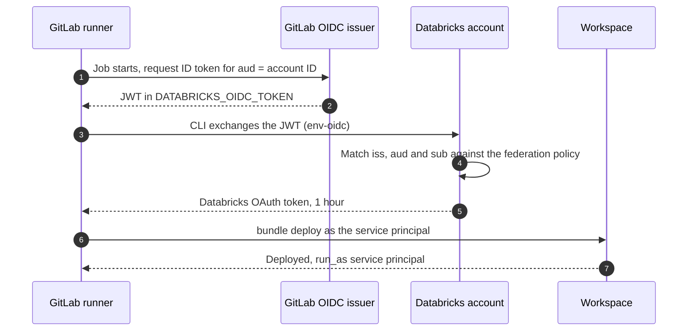

# Databricks service principals for CI/CD

> How the CI/CD identity works on Azure Databricks, and the recommended setup for
> a GitLab pipeline. Covers the two kinds of service principal, the four
> authentication routes, and the OIDC federation build.
> Pairs with 2026-06-25-databricks-infra-setup-sequence.md (Phase 1 identity and
> Phase 7 promotion) and ../202606-env-setup/2026-06-24-databricks-cicd-promotion-play-DRAFT.md
> (the promotion play).

A service principal is the non-human identity that deploys bundles, runs jobs and applies Unity Catalog grants. The grants go through Terraform, the API or SQL rather than through a bundle: bundles cover jobs, pipelines, dashboards, model serving endpoints and MLflow objects, and Phase 7 of the deployment guide keeps Unity Catalog under Terraform. Databricks advises against running automation under a user's personal access token: the service principal can be scoped independently of any person, disabled on its own, and it survives that person leaving. Jobs can also be set to run as the service principal rather than as their owner.

## Two kinds on Azure

The choice is made at creation time and is not cosmetic.

| | Databricks managed | Microsoft Entra ID managed |
| :--- | :--- | :--- |
| Where the identity lives | Databricks account only | Entra app registration, linked into Databricks by application (client) ID |
| Created by | Account or workspace admin | Entra admin, then linked in Databricks |
| Reaches other Azure resources | No | Yes, same credential |
| Lifecycle owner | Databricks account admin | Entra tenant |

Pick Entra managed when the same process must authenticate to Databricks and to other Azure resources in one run, which is the only case Databricks endorses it for. Otherwise pick Databricks managed.

Two provisioning facts that catch people out. SCIM never syncs service principals, only users and groups, so under SCIM every service principal is added by hand. Automatic identity management does sync them, uses Entra as the source of truth, and is on by default for accounts created after 1 August 2025, which includes this account.

## Authentication routes, best first

| Route | Credential | When |
| :--- | :--- | :--- |
| OIDC token federation | None, the runner's own ID token | Default for CI/CD |
| OAuth M2M | Databricks client ID and secret | Tools that do not implement unified authentication |
| Entra service principal | `ARM_TENANT_ID`, `ARM_CLIENT_ID`, `ARM_CLIENT_SECRET` | Same run also calls Azure APIs |
| Personal access token | Workspace PAT | Legacy, workspace APIs only, avoid |

OAuth access tokens last one hour and the CLI and SDKs refresh them. A service principal can hold up to five OAuth secrets, each valid up to 730 days, which is a rotation obligation you avoid entirely by federating.

Databricks does not treat federation as merely preferable. It strongly recommends workload identity federation for automated workloads wherever possible, on the grounds that removing secret management and rotation makes it more secure than the other mechanisms. Documented providers are GitHub Actions, Azure DevOps Pipelines, GitLab CI/CD, CircleCI, AWS IAM workloads, Jenkins, Terraform Cloud and Atlassian Bitbucket Pipelines.

## Recommendation for GitLab

Databricks managed service principals, one per environment, each with a GitLab OIDC federation policy pinned to project and ref. No secret in GitLab and no Entra app registration.

The pipeline here deploys bundles and applies grants. It does not need direct ADLS access, because Unity Catalog reaches storage through its own storage credential and Access Connector identity, not through the caller. That removes the argument for an Entra managed identity.

### Build

1. Create `gitlab-cicd-dev`, `gitlab-cicd-staging` and `gitlab-cicd-prod` as Databricks managed service principals. One external identity per service principal, which keeps audit attribution clean and lets you revoke one environment alone.
2. Assign each to its workspace with the entitlements it needs. None of them goes in the `admins` group.
3. Grant permissions to a Databricks group per environment and add the service principal to that group, rather than granting object by object. Use a Databricks-native group, not an Entra group synced by automatic identity management. The docs state that membership of groups managed by automatic identity management cannot be updated in Databricks, even with the immutable external groups preview disabled, and adding a member is such an update. It follows that a Databricks managed service principal cannot join a synced group, though the docs do not spell out that case, so test it if you want to try. If these service principals must sit inside your Entra group structure, make them Entra ID managed instead.
4. Decode a real GitLab ID token and read its actual `iss` and `sub` before writing any policy.
5. Create one federation policy per service principal, as account admin.
6. Set the four variables in the GitLab job and let the CLI do the exchange.

```bash
# numeric ID from the application ID
databricks account service-principals list \
  --filter 'applicationId eq "<app-id>"'

databricks account service-principal-federation-policy create <sp-numeric-id> --json '{
  "oidc_policy": {
    "issuer": "https://gitlab.com",
    "audiences": ["<databricks-account-id>"],
    "subject": "project_path:my-group/my-project:ref_type:branch:ref:main"
  }
}'
```

```yaml
variables:
  DATABRICKS_AUTH_TYPE: env-oidc
  DATABRICKS_HOST: https://adb-1234567890123456.7.azuredatabricks.net
  DATABRICKS_CLIENT_ID: <service-principal-application-id>

deploy:
  id_tokens:
    DATABRICKS_OIDC_TOKEN:
      aud: <databricks-account-id>
  script:
    - databricks bundle deploy -t prod
```

### Token exchange



## Getting the issuer and subject right

This is where the setup fails, and the Databricks pages disagree with each other on GitLab. One shows the issuer as `https://gitlab.com/example-group`, another as `https://gitlab.example.com`. GitLab documents `iss` as the domain of the GitLab instance and illustrates it with `https://gitlab.example.com`, from which SaaS resolves to `https://gitlab.com` and self-managed to your own instance URL. That resolution is inference from the documented rule, not a value either publisher prints.

> ⚠️ Unverified — the Databricks GitLab example issuer looks wrong, and the GitLab pages carry no last-updated date, so their currency cannot be judged. Decode an actual token and use its `iss` verbatim.

GitLab's default `sub` is `project_path:{group}/{project}:ref_type:{type}:ref:{branch_name}`, where the ref type is a branch, a tag or a merge request. Add a throwaway job that prints the JWT payload, read the two claims, then delete the job. That decode is the real verification step, not a precaution.

## Guardrails

- The subject is the entire security boundary. Pin the prod policy to a protected branch and protect that branch in GitLab, or any branch in the project can deploy to production.
- Switch the sub claim to immutable components. GitLab's projects API accepts `ci_id_token_sub_claim_components`, set to something like `["project_id", "ref_type", "ref"]`. Confirmed on docs.gitlab.com, which carries no last-updated date. With the default path-based subject, renaming the group breaks authentication, and a future project reusing the old path would match the policy.
- Deactivate rather than delete. Deleting a service principal from the account stops its compute, fails its jobs and breaks anything shared with Run as Owner. Deactivation blocks authentication and keeps the permissions.
- Pin the CLI version in the runner image rather than installing on every run, so a CLI release cannot change the pipeline's behaviour on a day nobody deployed. Bundles need v0.218.0 or above, so pin at or above that floor.
- The limit is 20 federation policies per service principal. Multiple policies on one service principal are only for the same logical identity arriving through different providers, not for different workloads.
- Account and workspace limits are 10,000 combined users and service principals and 5,000 groups, counted per account and again per workspace. One service principal per environment stays far inside that.

## Effect on the setup sequence

The provisioning sequence carries this recommendation as of its version 1.8. Phase 1 creates the service principals for automation and prefers OIDC token federation over OAuth M2M secrets. The consequence for ordering is that the federation policy cannot be written until the GitLab project and its protected branches exist, so the policy step depends on the repository and lands later than the rest of Phase 1, even though the service principals themselves are created early.

## Open questions

> 🔲 To be defined — awaiting user input

- Whether a federation policy can attach to an Entra ID managed service principal as well as a Databricks managed one. The docs describe policies as attaching to "a service principal in your Databricks account" without distinguishing the two. Test before designing around it if tenant governance forces Entra managed.
- Whether automatic identity management carries a pricing tier requirement. Check in the account console. The tiers are Standard, Premium and Trial, and role-based access control is documented as Premium only, but no page states a tier for automatic identity management. The service principal cap question is closed: 10,000 combined users and service principals per account and per workspace, plus 5,000 groups.

## Sources

Verified against Microsoft Learn and GitLab Docs, per claim, 2026-08-10. Databricks pages updated January to July 2026. The two GitLab pages carry no last-updated date, so every GitLab-sourced claim here is content-confirmed but not freshness-checked.

- Service principals for CI/CD, why not a user PAT, supported platforms: https://learn.microsoft.com/en-us/azure/databricks/dev-tools/auth/service-principals
- Manage service principals, Databricks managed versus Entra ID managed, deactivation, OAuth over PAT: https://learn.microsoft.com/en-us/azure/databricks/admin/users-groups/manage-service-principals
- OAuth M2M, five secrets, 730 days, one-hour access tokens, env vars: https://learn.microsoft.com/en-us/azure/databricks/dev-tools/auth/oauth-m2m
- Entra service principal authentication, ARM_ variables, recommendation to prefer OAuth M2M: https://learn.microsoft.com/en-us/azure/databricks/dev-tools/auth/azure-sp
- Configure a federation policy, CLI and API, 20-policy limit, one identity per service principal: https://learn.microsoft.com/en-us/azure/databricks/dev-tools/auth/oauth-federation-policy
- GitLab CI/CD workload identity federation, env-oidc, id_tokens block: https://learn.microsoft.com/en-us/azure/databricks/dev-tools/auth/provider-gitlab
- Workload identity federation in CI/CD, full provider list, strength of recommendation: https://learn.microsoft.com/en-us/azure/databricks/dev-tools/auth/oauth-federation-provider
- Bundle command group, `-t, --target` on deploy: https://learn.microsoft.com/en-us/azure/databricks/dev-tools/cli/bundle-commands
- Declarative Automation Bundles, what bundles deploy, CLI v0.218.0 floor: https://learn.microsoft.com/en-us/azure/databricks/dev-tools/bundles/
- Automatic identity management, default on after 1 August 2025, SCIM does not sync service principals: https://learn.microsoft.com/en-us/azure/databricks/admin/users-groups/automatic-identity-management/
- GitLab ID tokens, sub claim format, ci_id_token_sub_claim_components: https://docs.gitlab.com/ci/secrets/id_token_authentication/
- GitLab connect to cloud services, claim reference: https://docs.gitlab.com/ci/cloud_services/

<!--
Version: 1.3 | Last Updated: 2026-08-10 | Status: Draft
-->
