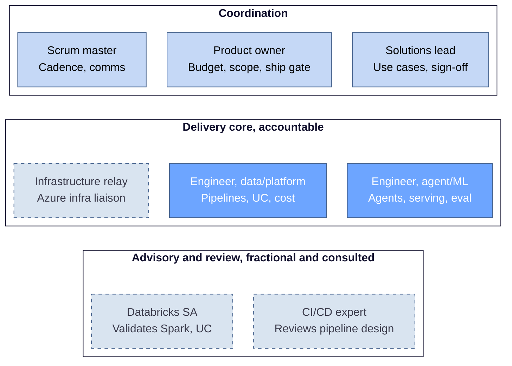

# Databricks platform team organisation

> Reference: Databricks platform
> Classification: C2 - Restricted
> Version 0.1 - July 2026

## 1 Purpose

This document defines the team structure and role accountabilities for the Databricks platform squad. It sets who owns what, how work is prioritised, and how the advisory roles engage.

## 2 Team structure

One squad, one backlog. Every member develops pipelines and agents. Roles sit in three functional tiers plus a fractional advisory layer. The tiers describe function, not reporting lines.

| Tier | Roles | Accountability |
|---|---|---|
| Coordination | Product owner, solutions lead, scrum master | Set priority, accept work, run cadence |
| Delivery core | Engineer data/platform, engineer agent/ML, infrastructure relay | Build and operate the platform and agents |
| Advisory and review | Databricks SA, CI/CD expert | Consulted on complex topics, not accountable |

Solid nodes are accountable operating roles. Dashed nodes are consulted or liaison roles, not accountable. The infrastructure relay is a liaison to the central Azure infra team, responsible for requests rather than design. The two advisors are fractional and engaged on trigger, not booked to the squad full time.

## 3 Roles

Every operating role carries a named accountability. The two advisory roles are consulted, not accountable.

| Role | Owns | RACI | Notes |
|---|---|---|---|
| Product owner | Budget, roadmap, scope, single prioritised backlog, ship decision | Accountable for priority and spend | Holds the FinOps decision. Ranks the backlog with the solutions lead. |
| Solutions lead | Business use cases, agent deployment acceptance, stakeholder management | Accountable for business sign-off | Proposes and validates use cases. Ranks the backlog with the product owner. |
| Scrum master | Cadence, communication, impediment removal | Facilitates | Full-time role at this size. |
| Engineer, data/platform | Pipelines, ingestion, Unity Catalog operation, IaC, cost visibility | Accountable for platform build | Standing technical lead for the platform side. |
| Engineer, agent/ML | Agents, model serving, evaluation, guardrails | Accountable for agent build | Design owner for the agent side. Single point of failure, needs cross-cover. |
| Infrastructure relay | Azure infra and network requests, provisioning tickets, landing zone | Responsible for tickets, not design | Liaison to the central infra team. Everything upstream of the workspace. |
| Databricks SA | Validation of Spark tuning, Unity Catalog design, cluster and networking decisions | Consulted, not accountable | Fractional. Reviews on request against a design record. |
| CI/CD expert | Review of pipeline design, support on hard release problems | Consulted, not accountable | Fractional. The pipeline mechanism is owned in-squad. |

## 4 Key design decisions

- One backlog with a single prioritisation authority. The product owner and solutions lead rank the topics according to use case value and required enablers.
- Accountability stays in-squad. Advisors validate but do not own. Platform, governance, FinOps and the release mechanism each have a named owner.
- Three-way deployment gate. The CI/CD mechanism is owned by an engineer, business acceptance by the solutions lead, the ship decision by the product owner and solutions lead. A green UAT does not auto-promote to production.
- Advisory engagement is triggered, not ad hoc. A design record, a Unity Catalog change or a new cluster policy triggers an SA or CI/CD review with an agreed turnaround.

## 5 Open items

- Tie-breaker rule for joint ranking by the product owner and solutions lead, to avoid stalls.
- Named GDPR accountable owner.
- Confirmation of whether the SA, CI/CD expert and relay are shared across other squads, which affects velocity planning.
