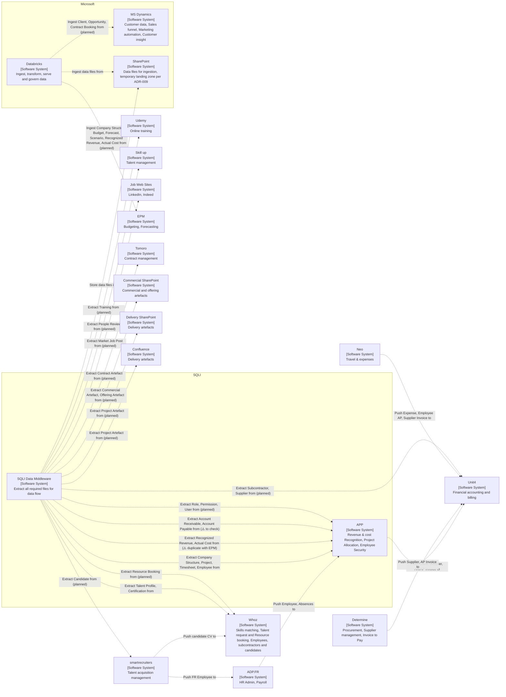

# SQLI System - O2 Ingestion View - Q3 2026

## Context

The flow chart describes the main data entities flow across SQLI applications.

Taking each data entities flow end to end shows which system produce the data which system(s) consume it. 

The goal of the document is to check with the teams:
- completness of main Entities flowing in the System
- accuracy of the lineage
- ingestion checklist
- data ownership boundaries consistencies with system boundaries

This is a important input to determine the **company data governance**. 

## Legend

Each application node refer to C4 notation:
- system name
- [system level of abstraction]
- system function

Arrows text describe the data entities flowing from one system to the other.

Arrows direction matters to determine the **data entity flow direction**, ie provider and subsribers, and indirectly consumers and producers.

## Notes

- Manual AR/AP Invoice entry for NL, DE, SE in Unit4
- Manual month end accrual entry in Unit4
- Manual Employee creation for all countries but FR in APP

## Vocabulary

Ingestion edges use the entity names from [domain-taxonomy](domain-taxonomy.md), so the chart
and the taxonomy compare mechanically. Entity names are singular.

Application-to-application edges keep the source systems' own vocabulary, because those flows
are upstream of O2 and renaming them would assert equivalences nobody has checked. So
`candidate CV` is a document rather than the Candidate entity, and `Employee AP` and
`Supplier Invoice` are Unit4 concepts that may not equal Account Payable and AP Invoice.

Two bookings exist and they are different entities. `Resource Booking` in `project-resources`
is a person booked onto work. `Contract Booking` in `sales-opportunities` is committed revenue.

Assignment is a relation between a person and a project, not an entity.

## Reading the arrows

Two conventions coexist and they point in opposite directions relative to the data.
`Push X to` points at the receiver, so the arrow follows the data. `Extract X from` and
`Ingest X from` point at the provider, so the arrow runs against the data. A consequence worth
stating plainly: a provider never has an outgoing arrow in this chart, so absence of an outgoing
arrow says nothing about whether a system supplies data.

That qualifies the Legend, which says arrow direction determines the flow direction. It does,
but only once the verb is read first.

## Status of a flow

Status comes from the `status` column in [o2-data-sources](o2-data-sources.md), where **active**
means the feed lands and is ingested, **inactive** means it lands and is not ingested, and
**planned** means it does not land yet. Chart labels carry `(planned)` for the third case, and a
`⚠️` marker where the flow itself is in question rather than its status.

## Open gaps

Cross-checked against the feed configuration and the taxonomy on 2026-08-06.

- Five entities sit in subdomains that have landing feeds, yet no edge produces them:
  `Absence` and `Payroll` in `hr-administration`, `Statutory Report` in `finance-fa&c`,
  `Delivery Model` in `project-master`, and `Talent Request` in `project-resources`.
  `Absence` is the sharpest of the five, because ADP pushes Absences into APP and
  `perso_leave_report` lands daily, so the data arrives and the chart does not show it.
  `Talent Request` is likely a Whoz flow, given Whoz is described as covering talent request.
- Unit4 now supplies Subcontractor and Supplier as a planned extraction. Still unresolved from
  Unit4: `finance-operations` beyond the two accounting entities already flagged,
  `finance-treasury` entirely, and Statutory Report. Determine and Neo still reach O2 only
  through Unit4, so nothing of theirs arrives directly.
- Account Receivable and Account Payable are marked to check on the APP edge. If they in fact
  originate in Unit4, they move to the Unit4 edge and `finance-operations` gains a producer.

Resolved 2026-08-06. Databricks ingestion from SharePoint is shown as active, which makes the
chart agree with the 19 active feeds, since **active** means landed and ingested.

> ⚠️ As-of caveat. Ingestion is imminent rather than verified running at the time of writing, so
> this edge and the 19 active feeds describe the state this document is titled for, Q3 2026,
> rather than a state observed today. It is consistent with the title, and it is the one claim in
> the chart that a reader should not take as verified lineage. Re-check once the workspace is up,
> and if ingestion slips, the 19 feeds are **inactive** by the stated definition and this edge
> returns to planned.

## Data Entities Flow Chart

