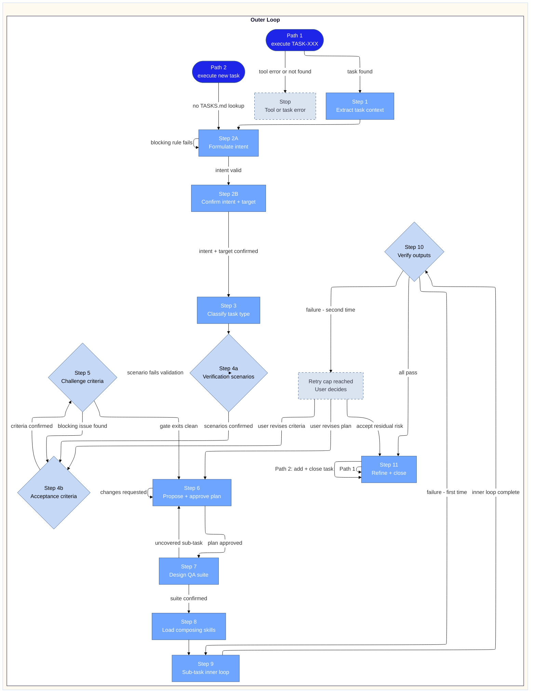

# Executing-Tasks Workflow Guide

This guide explains the `executing-tasks` skill — a quality-gated orchestration layer
that wraps every workspace task execution in a repeatable sequence of intent confirmation,
challenge, planning, QA design, and verification.

The skill does not implement domain logic. It ensures no task runs without confirmed
scope, agreed acceptance criteria, and traceable tests.

---

## Two entry paths

| Path | When | First step |
| :--- | :--- | :--- |
| Path 1 | Task exists in TASKS.md (`execute TASK-XXX`) | Read task entry from TASKS.md |
| Path 2 | No prior TASKS.md entry (`execute new task`) | Proceed directly to intent formulation |

Both paths converge at Step 3 (classify) and follow the same outer loop from there.

---

## Workflow overview

---

## Step-by-step reference

### Step 1 — Extract task context (Path 1 only)

Reads the TASK-XXX entry from TASKS.md. Requires fields: `description`, `scope`, `target`,
`origin`. If the task is not found or the read fails, the workflow stops with an explicit
error. `scope` is used only for intent pre-fill at Step 2A — it is retired as a working
field after Step 2A confirms and is not referenced in any downstream step.

### Step 2 — Intent formulation

Two-sub-step gate. Neither sub-step can be skipped or bypassed.

**Step 2A** renders an elicit form (Artifact 1) with three fields: an actor pill group
(`user` / `System` / `Other`), an action textarea (verb + object), and a value textarea
(observable benefit). On submit, five blocking validation rules from `intent-schema.md`
are applied — any failure returns the form for correction before Claude assembles the
intent sentence. Once all five rules pass, the assembled sentence is validated against
the schema before Artifact 2 is rendered.

Two actor values require additional handling beyond the five blocking rules: if `System`
is selected, an advisory is surfaced and explicit user confirmation is required before
proceeding; if `Other` resolves to `API <n>`, Claude blocks and asks the user to correct
the actor.

**Step 2B** confirms the assembled intent sentence and the target path. The user may edit
either field before submitting. If the intent sentence is edited, all five blocking rules
re-run before acceptance.

Intent sentence structure: `"As [actor] I need to [action] so that [value]"`

### Step 3 — Classify task type

Reads `composing-skills.md` and applies the decision table to the confirmed intent and
target. Classification is stated explicitly before proceeding: task type, composing skills,
and sub-task pattern.

If no signal in the confirmed intent matches a table entry, Claude defaults to the `doc`
pattern and states this explicitly:

> "No clear type signal found — defaulting to doc pattern. If this is incorrect, confirm
> the correct type before proceeding."

### Step 4a — Verification scenarios

Claude presents the Given/When/Then schema and asks the user to author scenarios one at
a time. After each submission, Claude validates it immediately against the four blocking
criteria below. If validation passes, Claude confirms acceptance and asks: "Add another
scenario, or confirm the set is complete?" If validation fails, Claude returns the scenario
with the specific field and issue identified — the user corrects and resubmits before any
further scenarios are accepted. Claude does not accept a new scenario while a correction
is pending.

The four blocking criteria:

| Criterion | Action on failure |
| :--- | :--- |
| No file paths, tool calls, or assertions in any field | Return to user with specific field flagged |
| `When` contains exactly one trigger | Return to user; ask to split |
| `Given` describes system or data state — not storage, tools, or implementation | Return to user with specific gap identified |
| `Then` describes an observable outcome — not an internal quality judgment | Return to user with specific gap identified |

The step does not close until the user explicitly confirms the set is complete. Silence
or submitting one scenario without confirmation is not completion.

### Step 4b — Acceptance criteria

Claude derives observable, unambiguous conditions from each confirmed scenario. These are
proposed to the user in a table (scenario ID → acceptance criterion). The user confirms
or modifies. These criteria become the evaluation anchor for Step 5 and the constraint
frame for Step 6. Every sub-task output at Step 6 must be traceable to at least one
criterion from this step.

### Step 5 — Challenge acceptance criteria

Reads `challenge-protocol.md`. Runs a minimum of two challenge rounds against the
acceptance criteria in a defined order:

| Round | Focus |
| :--- | :--- |
| Round 1 | Criteria viability — are criteria achievable, unambiguous, and not contradictory? |
| Round 2 | Criteria completeness — does the set cover the full scope of confirmed intent? |
| Round 3+ | Edge cases and failure modes |

After each round, Claude asks internally whether a new blocking issue was found. If yes,
the next round runs immediately without asking the user. If no, Claude surfaces the finding
and asks once: "No new blocking issues found. Approve plan, or request another challenge
round?"

If blocking issues persist after three rounds, Claude surfaces them and asks the user to
choose: revise the intent or criteria, or accept residual risk and proceed. The gate does
not exit on user impatience — explicit approval is always required.

### Step 6 — Propose and approve plan

Produces a stepped plan where every sub-task output is traceable to at least one
acceptance criterion from Step 4b. Closes with: "Does this plan meet the acceptance
criteria agreed in Step 4b?" Revisions loop until explicit approval.

### Step 7 — Design QA suite

Runs after plan approval, before any execution. First validates plan coverage: each
sub-task must map to at least one acceptance criterion and have a defined output. If
either check fails for any sub-task, the workflow returns to Step 6 to revise the plan —
not to Step 4b to revise criteria.

Once coverage passes, each acceptance criterion is expanded into one or more QA test
rows (ID | Assertion | Pass condition | Fail condition | Artifact). Claude states a
confidence percentage with a one-line rationale before awaiting user confirmation.

If the user objects to a test row, Claude distinguishes two cases: an objection to the
criterion itself returns to Step 4b; an objection to Claude's test expansion is fixed in
the QA suite only, without revisiting Step 4b.

### Step 8 — Load composing skills

Loads each skill from the `Composes With` table matched at Step 3. States which skill
governs each sub-task before entering the loop.

### Step 9 — Sub-task inner loop

Reads `subtask-patterns.md`. Applies the inner loop for the classified task type. For
each sub-task: Create tests → Write → Run → Test → Debug → repeat if failing.

The **Inner-loop checklist** for the classified pattern is the formal test gate — not a
prose description. Checklist items carry severity levels:

| Severity | Meaning | Confidence impact |
| :--- | :--- | :--- |
| Blocking | Failure makes the verification scenario untestable | Drops confidence to 0% |
| Major | Partially invalidates a verification scenario item | Drops 20–40% per item |
| Minor | Quality gap — scenario remains valid | Drops less than 10% per item |

After all sub-tasks complete, Claude surfaces the **Inner Loop QA Report** — a structured
table covering all sub-tasks with ID, assertion, severity, result, and detail columns —
plus an adjusted confidence percentage. If all items pass, execution proceeds to Step 10
automatically. Any failure holds execution pending explicit user input.

### Step 10 — Verify

Runs every QA test from the Step 7 suite against all outputs. Reports ✅ Pass |
⚠️ Partial | ❌ Fail per test. The full QA report is surfaced at the end of this step,
before Step 11 begins.

First failure on a sub-task returns to Step 9. Second failure on the same sub-task hits
the retry cap: user chooses between revising the acceptance criterion (returns to Step 4b),
revising the plan sub-task (returns to Step 6), or accepting residual risk and proceeding
to Step 11.

### Step 11 — Refine and close

Applies targeted fixes for any ⚠️ partial results from Step 10. When all tests pass,
surfaces the full QA report and prompts for close.

**Path 1:** prompts `done TASK-XXX` via managing-tasks.

**Path 2:** calls `add task` (passing the confirmed intent sentence, target, and a
session-derived origin field) then immediately calls `done task` using the TASK-ID
assigned by `add task`.

Path 2 session-interruption recovery: if the session ends after `add task` confirms but
before `done task` is called, the task will exist in TASKS.md as In Progress with no
close. On resumption, use `execute TASK-XXX` (Path 1) with the assigned TASK-ID, skip
to Step 11, and call `done task TASK-XXX`.

---

## Hard gates summary

| Gate | Location | Unblocking condition |
| :--- | :--- | :--- |
| Intent validation | Step 2A | All five blocking rules pass; assembled sentence validated against schema |
| Intent + target confirmation | Step 2B | User submits Artifact 2 |
| Scenario validation | Step 4a | Each scenario passes all blocking criteria; no correction pending |
| Set completion | Step 4a | User explicitly confirms the set is complete |
| Criteria confirmation | Step 4b | User explicitly confirms or modifies |
| Challenge gate | Step 5 | Minimum two rounds run; no blocking issues in last round; user explicit approval |
| Plan approval | Step 6 | Explicit yes to "Does this plan meet criteria?" |
| Plan coverage | Step 7 | Every sub-task maps to a criterion and has a defined output |
| QA suite confirmation | Step 7 | User confirms suite before execution begins |
| Inner-loop checklist | Step 9 | All Blocking items pass before advancing sub-task |
| Retry cap | Step 10 | User chooses: revise criterion / revise plan / accept residual risk |

---

## What this skill does not do

- Manage task state — that belongs to `managing-tasks`
- Implement domain logic — defers to composing skills per task type
- Skip, bypass, or reorder any gate — all steps are sequential and every gate is blocking
- Proceed on implied consent — explicit user approval is required at every hard gate

---

| Field | Value |
| :--- | :--- |
| Version | 1.2 |
| Last Updated | 2026-04-11 |
| Status | Draft |
