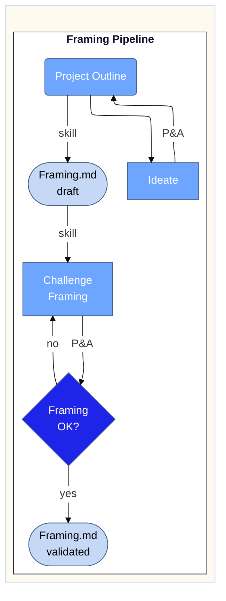

# Framing Pipeline

Process flow for the chief-of-droids framing lifecycle: ideation through to a validated `Framing.md`. Captures the iterative loops at ideation (A↔B) and at validation (D↔E), and the role of skill-triggered transitions vs prompt-and-answer turns.

## Class mapping

| Node(s) | Class | Reason |
| :--- | :--- | :--- |
| E | `primary` | Sole decision gate — highest visual weight |
| A, B, D | `secondary` | Process steps |
| C, F | `tertiary` | Document artifacts |
| FramingPipeline | `primary_cluster` | Single named container |
| Main | `main` | Mandatory invisible wrapper |

## Edge labels

| Label | Meaning |
| :--- | :--- |
| `P&A` | Prompt & answer — user prompts, model responds |
| `skill` | Skill-triggered transition (`project-bootstrapping` for B→C, `analyzing-business-cases` challenge for C→D) |
| `no` / `yes` | Decision branches from the validation gate |

## Notes

The two `Framing.md` nodes (C and F) represent the same artifact at two states — `draft` (input to the challenge phase) and `validated` (output, gate passed). They are visually distinct via the `draft` / `validated` qualifiers in the labels.

The `B → A` back-edge is unlabelled — implied iteration continues until the outline stabilises and routes to the framing skill.

Theme assets sourced from `shared/elevate-theme/elevate-mermaid.md` (canonical Elevate Mermaid block, v1.8). Init block deduplicated relative to canonical source — see TASKS.md TBD if filed.

| Field | Value |
| :--- | :--- |
| Version | 1.0 |
| Last Updated | 2026-05-04 |
| Status | Draft |
