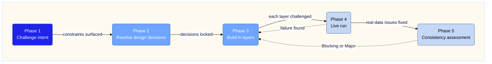

# How to Create a Skill in the Chief of Droids Workspace

A step-by-step account of how the `managing-sessions` skill was designed,
challenged, built, and assessed — in a single session lasting approximately
3–4 hours on 2026-03-28.

The session began at 9:08 am with a one-line intent statement. It ended with
a committed, assessed, and rated skill with four reference files, two output
directories, a findings file from a live run, and a session removal log.
Nothing was skipped. Nothing was done without challenge first.

This document preserves the logic and philosophy of that process so it can be
repeated for any new skill.

---

## What the process looks like, end to end

The user opened at 9:08 am with a single statement of intent:

> "My intent is to build a skill to manage session history for a project."

Seven numbered requirements followed. That was the entire brief. No file
structure, no reference files, no workflow steps. Just intent.

What followed over the next 3–4 hours was:

1. Challenge the intent against platform constraints
2. Resolve design decisions before writing anything
3. Build the skill incrementally with challenge rounds at each stage
4. Run the skill for real (live session analysis)
5. Apply fixes surfaced by the live run
6. Run the consistency checklist to catch structural and authoring debt
7. Apply checklist findings and confirm Pass

The output was not written in one pass. It was written, challenged, patched,
challenged again, and patched again. That is the expected pattern, not a sign
that something went wrong.



---

## Phase 1 — Challenge before designing

The first thing that happened after the intent was stated was not a design
proposal. It was a challenge of the requirements against what is actually
possible.

Three hard constraints surfaced immediately:

- **`recent_chats` is project-scoped.** Solution: "run once per project, logs accumulate centrally."
- **Claude cannot delete sessions.** Solution: execution is always manual in the claude.ai UI.
- **`userMemories` is not readable as a file.** Solution: compare them against whatever
  was in context.

These constraints were surfaced before any file was written.

**The principle:** challenge requirements against real platform behaviour
before designing anything. Constraints discovered during build are expensive.
Constraints discovered during the challenge phase cost nothing.

---

## Phase 2 — Design decisions, confirmed before build

With constraints established, three design decisions were locked:

| Decision | Choice made | Rationale |
| :--- | :--- | :--- |
| Auto-trigger mechanism | System prompt rule: if `recent_chats` ≥10 at bootstrap, invoke skill | Skill system cannot monitor passively; only mechanism available |
| Session log fidelity | Structured summary: title, date, decisions extracted — written to disk | Full transcripts not exportable; this is the maximum achievable fidelity |
| userMemories challenge | Skill reads on-disk sources only; flags what *could* be contradicted | userMemories not accessible as a file; context-visible only |

These were not guesses. They were the output of a structured question
presented to the user before any implementation began.

**The principle:** for any skill with conditional branching or design
alternatives, resolve the decisions before writing. A skill built on
unresolved design questions will be patched repeatedly after build.

---

## Phase 3 — Incremental build with challenge at each stage

The skill was not written in one pass. It was built in layers, with a
challenge round after each layer:

**Layer 1 — SKILL.md and reference file stubs**

Initial structure: frontmatter, reference file declarations, workflow
outlines.
Running from different projects would produce filename collisions and
incorrect memory challenge scope. Step 0 was added.

**Layer 2 — Storage layout**

Initial design: single log file in `logs/`. Challenge surfaced that
findings (extracted value) and removal records (which sessions were deleted)
are categorically different. Split into two output paths:
`.tasks/sessions-findings/` and `.logs/sessions-removed/`.

**Layer 3 — Confidence model**

The skill initially used a single `recent_chats` call and one
`conversation_search` call. A challenge round asked: what is the actual
confidence of a single pass? Answer: unknown and low.
The 5-pass model was designed in response.
Each pass has a specific role. None is redundant.

**Layer 4 — Reference files**

`what-to-capture.md`: 7 categories, each with signal phrases, a canonical
`search_query`, a capture condition, an on-disk verification
target, and a risk-if-missed statement.

`session-log-schema.md`: two schemas — findings file and removal log.

`memory-contradiction-rules.md`: 7 rules, each checking a specific class
of memory claim against a specific on-disk source.

**The principle:** build in layers. Challenge after each layer. Do not
try to get the whole skill right in one pass — the structure will surface
issues that were invisible during design.

---

## Phase 4 — Live run before assessment

Before any checklist or formal assessment, the skill was run for real against
the actual project session history.

Anthropic's official guidance on skill quality is observation-based: identify
gaps by running agents on representative tasks, monitor how Claude uses the
skill in real scenarios, and iterate based on what you observe. The live run
is the primary quality gate — not the checklist.

1. It validated that the workflow actually executes correctly against
   real data — not just that it reads correctly on paper.
2. It produced useful output: a findings file with 11 `not-on-disk`
   findings and a removal log for 9 sessions. The run was not a test —
   it was real work.

The live run surfaced one real-data behaviour the design had not accounted
for: `conversation_search` can return false positives — sessions that match
the query string but contain no relevant finding. This was fixed before the
checklist was run.

**The principle:** the live run is the highest-confidence test available.
Run it first. Fix what it surfaces. Only then run the consistency checklist.
A skill that passes the checklist but fails on real data is not a pass.

---

## Phase 5 — Consistency checklist with the `creating-skills` skill

After the live run and its fixes, `critique skill managing-sessions` was
invoked. The assessment checklist was read from disk. Official sources were
fetched. All four skill files were read fresh.

The checklist's role is consistency and maintainability — not behavioural
quality. It catches structural debt (missing ToCs, SKILL.md bloat, missing
failure handling) and authoring conventions (description length, imperative
form, frontmatter compliance). It cannot catch execution errors or trigger
mismatches — those only surface in real usage.

The first assessment (v1.5) produced:

| Severity | Count | Items |
| :--- | :--- | :--- |
| Blocking | 3 | Reference files >100 lines with no ToC |
| Major | 4 | Pass 4 boundary ambiguous; dedup key unspecified; partial result unhandled; false positives unhandled |
| Minor | 3 | Description framing; Rule 7 hardcoded path; HOW-TO-TRIGGER.md stale path |

All 10 findings were applied in a single fix pass. The second assessment
(v1.6) produced 4 Minor findings only — all maintenance items, none
affecting current execution correctness.

**Final rating: Pass.**

**The principle:** the checklist surfaces structural and authoring debt, not
behavioural defects. Expect Blocking and Major findings on a first assessment
of a complex skill — that is the checklist working correctly. Fix them. But
do not mistake a Pass rating for proof that the skill executes correctly in
real scenarios. That proof comes from the live run.

---

## The philosophy in three sentences

Challenge before building — every design assumption that is not challenged
before implementation becomes a defect discovered during build or after
deployment.

Build in layers, not in one pass — each layer is cheap to challenge and
patch; a completed skill is expensive to restructure.

Run before assessing — a live run against real data reveals what no
checklist can: whether the workflow actually does what it claims to do
in the conditions it will actually face.

---

## Checklist for creating a new skill

Use this as a gate before starting implementation.

**Pre-build:**

- [ ] Intent stated in plain language — what does the skill do, when does it
  trigger, what are its inputs and outputs
- [ ] Requirements challenged against platform constraints — what cannot be
  done, what must be approximated, what is the correct scope
- [ ] Design decisions resolved — branching conditions, output format,
  write authority, trigger mechanism

**Build:**

- [ ] SKILL.md and reference file stubs written — structure only, no bulk content inline
- [ ] HOW-TO-TRIGGER.md updated with new skill entry and combining table row

To inspect the workflows and authoring rules before starting, run:

```
read skills/creating-skills/SKILL.md
```

The structural and authoring rules — frontmatter spec, reference file conventions,
workflow-class criteria — are governed by `creating-skills`. They are applied
during the consistency assessment, not tracked here.

**Before the consistency assessment — live run first:**

- [ ] Live run executed against real data — not a synthetic test
- [ ] Real-data issues surfaced and fixed before assessment is run

**Consistency assessment:**

Invoke `critique skill <n>`. Fix all Blocking and Major findings. Re-invoke after
fixes and confirm the rating is Pass before committing.

Expect Blocking and Major findings on a first assessment of a complex skill —
that is the checklist working correctly.

> Note: a Pass rating confirms structural compliance — not that the skill
> executes correctly in real scenarios. That is only confirmed by the live run.

---

## File and directory conventions

| Item | Convention |
| :--- | :--- |
| Skill folder name | Gerund form: `managing-sessions`, `writing-docs`, `creating-skills` |
| SKILL.md frontmatter `name` | Same as folder name — lowercase, hyphens, max 64 chars |
| Reference files | `references/<noun>.md` — one concept per file |
| Output files (findings) | `.tasks/sessions-findings/YYYY-MM-DD-<project>-<type>.md` |
| Output files (removal logs) | `.logs/sessions-removed/YYYY-MM-DD-<project>-removed.md` |
| HOW-TO-TRIGGER.md | Updated via `creating-skills` workflow — never edited directly from a project |
| Version block | Every `.md` written to disk includes version, date, status |

---

## What made this session work

The skill took 3–4 hours from first prompt to committed Pass rating.
That is not slow — it is the correct pace for a skill of this complexity.

What made it work:

- The user challenged every output before approving it. Multiple rounds
  of challenge were the norm, not the exception. The final skill is
  substantially different from the initial design because of those challenges.
- No file was written without a confirmed design. The gap between "intent
  stated" and "first file written" was approximately 45 minutes of challenge
  and decision-making.
- The live run was treated as real work, not a test. The findings file and
  removal log it produced are genuine workspace assets.
- The consistency checklist was run after the live run — not instead of it.
  10 findings on a first checklist assessment is not a failure — it is the
  checklist doing its job. Fix them and re-assess.

| Field        | Value      |
|:-------------|:-----------|
| Version      | 1.5        |
| Last Updated | 2026-03-31 |
| Status       | Final      |
