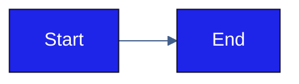

# Elevate Theme — Usage Guide

> Canonical source: `shared/elevate-theme/tokens.json`  
> Do not edit derived files directly — update `tokens.json` and regenerate.

---

## Files in this folder

| File | Format | Use with |
| :--- | :----- | :------- |
| `tokens.json` | JSON | Canonical source of truth — colors + roles + typography + contrast pairs |
| `theme1.xml` | OOXML XML | `.pptx`, `.docx`, `.xlsx` — clrScheme part |
| `settings-clrSchemeMapping.xml` | OOXML XML snippet | `.docx` only — role mapping injected into `word/settings.xml` |
| `elevate.css` | CSS | HTML, any web project |
| `elevate-tokens.js` | ES module | React inline styles; Tailwind CSS v3 |
| `elevate-tailwind-v4.css` | CSS (`@theme`) | Tailwind CSS v4 |
| `elevate-mermaid.md` | Markdown | Mermaid diagrams — copy the init block |
| `elevate-artifact.md` | Markdown | HTML / React artifacts with form elements — `applyAll()` pattern |
| `README.md` | Markdown | This file |

---

## Two-layer model

Elevate distinguishes between **palette tokens** (the canonical hex values, named
to match OOXML slots) and **role aliases** (logical names authors and templates use).

| Layer | Names | Where it lives | Purpose |
| :---- | :---- | :------------- | :------ |
| Palette | `dk1`, `lt1`, `dk2`, `lt2`, `accent1`–`accent6`, `hyperlink`, `followedHyperlink` | `theme1.xml` (Office), `tokens.json` (canonical) | Physical hex storage; OOXML-compatible names |
| Roles | `tx1`, `tx2`, `tx3`, `bg1`, `bg2` (+ accents reused) | `tokens.json` (`roles` block), template references, generators | Logical author-facing names; what gets used in `var(--…)`, JSX, generator code |

**OOXML never sees the role aliases.** `theme1.xml` carries only palette names.
For `.docx`, the role-to-slot binding is materialised as a separate
`<w:clrSchemeMapping>` element in `word/settings.xml` (see `settings-clrSchemeMapping.xml`).

This is OOXML's native pattern (ECMA-376 Part 4 §2.15.1.78), not a workaround.

---

## .pptx / .docx / .xlsx — injecting theme1.xml

Office files are ZIP archives. Inject the theme by unzipping, replacing the
theme file, and re-zipping. The critical constraint is internal path structure —
`zip -r` must not introduce a parent directory prefix into the archive.

```bash
# pptx example — same pattern for docx (word/) and xlsx (xl/)
cp your-file.pptx your-file-backup.pptx
cp your-file.pptx your-file-work.zip
unzip your-file-work.zip -d unpacked/
cp /path/to/elevate-theme/theme1.xml unpacked/ppt/theme/theme1.xml

# Re-zip: cd into unpacked/ first to avoid path prefix corruption
cd unpacked/
zip -r ../your-file-elevate.pptx .
cd ..
mv your-file-elevate.pptx your-file.pptx
```

**Why `cd unpacked/` before `zip -r`:** If you run `zip -r output.pptx unpacked/`
from outside the directory, every file will be stored at `unpacked/ppt/...`
instead of `ppt/...` — Office will fail to open it. Always zip from inside the
unpacked directory.

**Internal theme paths by format:**

| Format | Path inside ZIP |
| :----- | :-------------- |
| `.pptx` | `ppt/theme/theme1.xml` |
| `.docx` | `word/theme/theme1.xml` |
| `.xlsx` | `xl/theme/theme1.xml` |

**minorFont placeholder:** `theme1.xml` currently sets both `majorFont` and
`minorFont` to `TWK Everett Light`. Replace the `minorFont` `typeface` value
with the chosen body weight before deploying to production files.

**Font note (Office formats):** TWK Everett Light is a licensed commercial font
and must be installed on the machine opening the file. Office (Word, PowerPoint,
Excel) does **not** honour CSS-style fallback chains — when TWK Everett is
absent, Word substitutes silently using its own logic (typically Calibri or
Arial), regardless of what cascade is declared in `tokens.json` or `elevate.css`.

The cascade chain (`TWK Everett Light, Helvetica Neue, system-ui, …`) only
governs HTML / CSS / SVG / React renderings. For consistent `.docx` / `.pptx` /
`.xlsx` rendering across machines without TWK Everett installed, the realistic
options are: install the font on every target machine, or change `theme1.xml`
to declare a freely available font as the primary.

---

## .docx only — injecting clrSchemeMapping

For `.docx` files, the role aliases (`tx1`/`tx2`/`bg1`/`bg2`) are activated by
inserting `<w:clrSchemeMapping>` into `word/settings.xml`. This step is
**additional** to theme1.xml injection.

```bash
# Assume unpacked/ contains the unzipped .docx with theme1.xml already in place

# 1. Copy the snippet content (the <w:clrSchemeMapping> element only)
cat /path/to/elevate-theme/settings-clrSchemeMapping.xml

# 2. Open unpacked/word/settings.xml and insert the <w:clrSchemeMapping>
#    element as a direct child of <w:settings>. Order matters: place it after
#    <w:compat> (CT_Settings sequence requires clrSchemeMapping late in the
#    element order — inserting it as the first child fails schema validation).

# 3. Repack as usual
cd unpacked/ && zip -r ../output.docx . && cd ..
```

**What this enables:** Word's built-in heading styles, theme-aware tables, and
SmartArt resolve "primary text" / "primary background" through the mapping.
Without it, those styles fall back to OOXML defaults (background1 = light1,
text1 = dark1) and produce wrong colours.

**Why `.docx` only:** PowerPoint and Excel use `<p:clrMap>` and analogous
mechanisms with different attribute schemas. Adapt per format if needed; this
file targets WordprocessingML only.

---

## HTML / CSS

```html
<link rel="stylesheet" href="shared/elevate-theme/elevate.css">
```

Use semantic aliases, not raw palette tokens:

```css
body {
  background-color: var(--elevate-color-background);   /* bg1 */
  color: var(--elevate-color-text);                    /* tx1 */
  font-family: var(--elevate-font-family);
}

.btn-primary {
  background-color: var(--elevate-color-brand);        /* accent1 */
  color: var(--elevate-bg2);                           /* white */
}

a         { color: var(--elevate-color-link); }
a:visited { color: var(--elevate-color-link-visited); }
```

---

## React (inline styles)

```jsx
import { elevateTokens } from './shared/elevate-theme/elevate-tokens.js';

const styles = {
  container: {
    backgroundColor: elevateTokens.color.background,   // bg1
    color: elevateTokens.color.text,                   // tx1
    fontFamily: elevateTokens.font.family,
  },
  button: {
    backgroundColor: elevateTokens.color.brand,        // accent1
    color: elevateTokens.color.bg2,                    // white
  },
};
```

---

## Tailwind CSS v3

In `tailwind.config.js`:

```js
const { tailwindElevate } = require('./shared/elevate-theme/elevate-tokens.js');

module.exports = {
  theme: {
    extend: {
      colors: tailwindElevate,
    },
  },
};
```

In JSX:

```jsx
<div className="bg-elevate-bg1 text-elevate-tx1">
  <button className="bg-elevate-brand text-elevate-bg2 hover:bg-elevate-brand-light">
    Primary action
  </button>
  <a className="text-elevate-link visited:text-elevate-link-visited">
    Link
  </a>
</div>
```

---

## Tailwind CSS v4

Tailwind v4 uses CSS-first configuration — `tailwind.config.js` is not used for
colors. Import `elevate-tailwind-v4.css` after the Tailwind import:

```css
@import "tailwindcss";
@import "./shared/elevate-theme/elevate-tailwind-v4.css";
```

Generated utility classes follow the `--color-elevate-*` namespace:

```jsx
<div className="bg-elevate-bg1 text-elevate-tx1 font-elevate">
  <button className="bg-elevate-brand text-elevate-bg2 hover:bg-elevate-brand-light">
    Primary action
  </button>
</div>
```

---

## Mermaid

Copy the init block from `elevate-mermaid.md` and paste it as the first line of
your diagram. See that file for the full token mapping table, `primaryBorderColor`
override rationale, and `classDef` examples for accent5/accent6.

**Hex only:** Mermaid ignores named colors — always use hex values.



---

## SVG

Use CSS custom properties from `elevate.css`, or inline hex directly:

```xml
<svg xmlns="http://www.w3.org/2000/svg">
  <style>
    :root {
      --brand:  #1F24E9;
      --tx1:    #0F0E2B;
      --bg1:    #FFFAF0;
      --bg2:    #FFFFFF;
      --accent4:#425F8B;
    }
    rect.primary { fill: var(--brand); }
    rect.surface { fill: var(--bg1); stroke: var(--accent4); }
    text { fill: var(--tx1); font-family: "TWK Everett Light", "Helvetica Neue", sans-serif; }
  </style>
  <rect class="primary" x="10" y="10" width="200" height="80" rx="4"/>
  <text x="110" y="55" text-anchor="middle" fill="#FFFFFF">Label</text>
</svg>
```

---

## Palette reference

OOXML-compatible slot names. Used in `theme1.xml`. Authors should prefer the
role aliases below for application use.

| Token | Hex | Role / when to use |
| :---- | :-- | :----------------- |
| `dk1` | `#000000` | True black — structural ink only (gridlines, strokes); **not body text** |
| `lt1` | `#FFFFFF` | Pure white — secondary background |
| `dk2` | `#0F0E2B` | Near-black navy — text on light backgrounds (aliased as `tx1`) |
| `lt2` | `#FFFAF0` | Warm cream — primary background (aliased as `bg1`) |
| `accent1` | `#1F24E9` | Electric blue — primary brand fill (aliased as `tx3` for emphasis text) |
| `accent2` | `#6DA5FF` | Sky blue — secondary fill (aliased as `tx2` for text on dark backgrounds) |
| `accent3` | `#C5D8F6` | Ice blue — tints, code-block fills, banded table rows |
| `accent4` | `#425F8B` | Steel blue (muted) — dividers, blockquote text |
| `accent5` | `#6164EB` | Violet-blue — alternate accent for badges |
| `accent6` | `#8E8FEC` | Periwinkle (soft) — soft accent for tooltips |

## Role aliases reference

Logical names. Used by templates, generators, and CSS aliases. Authors should
reach for these first; use raw palette names only when the alias doesn't fit.

| Role | Alias of | Hex | Use |
| :--- | :------- | :-- | :-- |
| `tx1` | `dk2` | `#0F0E2B` | Primary text — body, headings, table cells |
| `tx2` | `accent2` | `#6DA5FF` | Secondary text — dark-fill contexts only |
| `tx3` | `accent1` | `#1F24E9` | Tertiary text — restricted to titles, hyperlinks, CTAs, callouts |
| `bg1` | `lt2` | `#FFFAF0` | Primary background — pages, slides, default canvas |
| `bg2` | `lt1` | `#FFFFFF` | Secondary background — high-contrast cards, table data rows |

---

## Typography

Canonical typography rules. Authoritative source: `tokens.json` `typography` block.

### Font cascade

Authoritative source: `tokens.json` → `typography.font_family.fallback_chain`.

```
TWK Everett Light, Helvetica Neue, system-ui, -apple-system, Arial, sans-serif
```

| Position | Font | Rationale |
| :------- | :--- | :-------- |
| 1 | TWK Everett Light | Brand primary — used when installed |
| 2 | Helvetica Neue | macOS default fallback — closest visual match to Everett (same Swiss-grotesk family); pre-installed on every Mac |
| 3 | system-ui | OS-native default |
| 4 | -apple-system | older macOS / iOS Safari token |
| 5 | Arial | Windows default |
| 6 | sans-serif | universal final fallback |

**Office formats (.docx / .pptx / .xlsx) do not honour this chain.** See the
"Font note (Office formats)" section above.

### Headings

| Level | Color | Size | Weight | Notes |
| :---- | :---- | ---: | :----- | :---- |
| Title | `tx1` | 22 pt | bold | Cover only — above H1 |
| H1 | `tx1` | 16 pt | bold | Top-level section, numbered |
| H2 | `tx1` | 13 pt | regular | Sub-section, numbered (e.g. 4.1) |
| H3 | `tx1` | 11 pt | regular | Sub-sub-section, numbered (e.g. 4.1.1); extra left indent |

Hierarchy is conveyed by **size + weight at H1 only**. Color is constant (`tx1`).
Do not use `accent1`/`tx3` for headings — readers misread brand-colored
headings as hyperlinks (WCAG 2.2 SC 1.4.1).

### Body

| Element | Color | Size | Weight |
| :------ | :---- | ---: | :----- |
| Paragraph | `tx1` | 11 pt | regular |
| List item | `tx1` | 11 pt | regular |

### Blockquote

| Property | Value |
| :------- | :---- |
| Text color | `accent4` (`#425F8B` steel blue) |
| Style | italic |
| Weight | regular |
| Size | 11 pt |
| Left indent | small |
| Border | none |

Use for callouts, asides, indicative passages. Italic + indent provide non-color
cues for distinguishing the block from body text — required by WCAG 2.2 SC 1.4.1.

### Code block

| Property | Value |
| :------- | :---- |
| Fill | `accent3` (`#C5D8F6` ice blue) |
| Text color | `tx1` |
| Font | monospace (`Cascadia Code`, `Consolas`, `Courier New`) |
| Size | 10 pt |
| Padding | block-level, full-width within text margins |
| Border | none |

### Inline code

Same fill / text / font as code block; size matches surrounding text (11 pt).

---

## Tables

Default table style. Matches Word's "Light Shading" behaviour when Elevate
theme is applied.

| Element | Token | Hex |
| :------ | :---- | :-- |
| Header fill | `accent2` | `#6DA5FF` |
| Header text | `tx1` | `#0F0E2B` |
| Data row fill | `bg2` | `#FFFFFF` |
| Banded row fill | `accent3` | `#C5D8F6` |
| Cell text (all rows) | `tx1` | `#0F0E2B` |
| Borders | none | — |

---

## Contrast pairing rules

Authoritative source: `tokens.json` `contrast_pairs` block. WCAG 2.2 SC 1.4.3
(AA) requires ≥ 4.5:1 for normal text; ≥ 3:1 for large text.

Quick reference — text colors allowed on each fill:

| Fill | Allowed text | Forbidden text |
| :--- | :----------- | :------------- |
| `bg1` (`#FFFAF0`) | `tx1`, `tx3`, `accent4`, `accent5` | `tx2` (2.1:1 fail) |
| `bg2` (`#FFFFFF`) | `tx1`, `tx3`, `accent4`, `accent5` | `tx2` (2.2:1 fail) |
| `dk1` (`#000000`) | `tx2`, `bg1`, `bg2` | `tx1`, `tx3` |
| `dk2` (`#0F0E2B`) | `tx2`, `bg1`, `bg2` | `tx1`, `tx3` |
| `accent1` (`#1F24E9`) | `bg1`, `bg2` | `tx1`, `tx2`, `tx3` |
| `accent2` (`#6DA5FF`) | `tx1` only | `tx2`, `tx3`, `bg1`, `bg2` |
| `accent3` (`#C5D8F6`) | `tx1`, `tx3` | `tx2` (1.6:1 fail) |
| `accent4` (`#425F8B`) | `bg1`, `bg2` | `tx1`, `tx2`, `tx3` |

`tx2` is only legible on dark fills (`dk1`, `dk2`). Anywhere else it fails AA.
`tx3` is restricted to titles, hyperlinks, CTAs, and callouts (see
`text_role_constraints` in `tokens.json`).

---

## Element role constraints

| Role | Allowed elements | Forbidden elements |
| :--- | :--------------- | :----------------- |
| `tx1` | body_paragraph, h1–h3, table_cell, caption, list_item | — |
| `tx2` | text_on_dk1_fill, text_on_dk2_fill | text_on_bg1, text_on_bg2, text_on_accent3 |
| `tx3` | cover_title, hyperlink, cta_button_text, callout_label | body_paragraph, h1–h3, table_cell, list_item |

`tx3` rule: brand-color text must always pair with a non-color visual cue
(underline for hyperlinks, button shape for CTAs, indent + italic for callouts).
WCAG 2.2 SC 1.4.1 / G183.

---

| Version | Last Updated | Status |
| :------ | :----------- | :----- |
| 2.1     | 2026-04-29   | Draft  |
