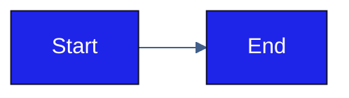

# Elevate Theme — Usage Guide

> Canonical source: `shared/elevate-theme/tokens.json`  
> Do not edit derived files directly — update `tokens.json` and regenerate.

---

## Files in this folder

| File | Format | Use with |
| :--- | :----- | :------- |
| `tokens.json` | JSON | Canonical source of truth — all colors + roles |
| `theme1.xml` | OOXML XML | `.pptx`, `.docx`, `.xlsx` |
| `elevate.css` | CSS | HTML, any web project |
| `elevate-tokens.js` | ES module | React inline styles; Tailwind CSS v3 |
| `elevate-tailwind-v4.css` | CSS (`@theme`) | Tailwind CSS v4 |
| `elevate-mermaid.md` | Markdown | Mermaid diagrams — copy the init block |
| `README.md` | Markdown | This file |

---

## .pptx / .docx / .xlsx — injecting theme1.xml

Office files are ZIP archives. Inject the theme by unzipping, replacing the
theme file, and re-zipping. The critical constraint is internal path structure —
`zip -r` must not introduce a parent directory prefix into the archive.

```bash
# pptx example — same pattern for docx (word/) and xlsx (xl/)
cp your-file.pptx your-file-backup.pptx
cp your-file.pptx your-file-work.zip
unzip your-file-work.zip -d unpacked/
cp /path/to/elevate-theme/theme1.xml unpacked/ppt/theme/theme1.xml

# Re-zip: cd into unpacked/ first to avoid path prefix corruption
cd unpacked/
zip -r ../your-file-elevate.pptx .
cd ..
mv your-file-elevate.pptx your-file.pptx
```

**Why `cd unpacked/` before `zip -r`:** If you run `zip -r output.pptx unpacked/`
from outside the directory, every file will be stored at `unpacked/ppt/...`
instead of `ppt/...` — Office will fail to open it. Always zip from inside the
unpacked directory.

**Internal theme paths by format:**

| Format | Path inside ZIP |
| :----- | :-------------- |
| `.pptx` | `ppt/theme/theme1.xml` |
| `.docx` | `word/theme/theme1.xml` |
| `.xlsx` | `xl/theme/theme1.xml` |

**minorFont placeholder:** `theme1.xml` currently sets both `majorFont` and
`minorFont` to `TWK Everett Light`. Replace the `minorFont` `typeface` value
with the chosen body weight before deploying to production files.

**Font note:** TWK Everett Light must be installed on the machine opening the
file. Office substitutes silently if the font is absent.

---

## HTML / CSS

```html
<link rel="stylesheet" href="shared/elevate-theme/elevate.css">
```

Use semantic aliases, not raw palette tokens:

```css
body {
  background-color: var(--elevate-color-background);
  color: var(--elevate-color-text);
  font-family: var(--elevate-font-family);
}

.btn-primary {
  background-color: var(--elevate-color-brand);
  color: var(--elevate-lt1);
}

a         { color: var(--elevate-color-link); }
a:visited { color: var(--elevate-color-link-visited); }
```

---

## React (inline styles)

```jsx
import { elevateTokens } from './shared/elevate-theme/elevate-tokens.js';

const styles = {
  container: {
    backgroundColor: elevateTokens.color.background,
    color: elevateTokens.color.text,
    fontFamily: elevateTokens.font.family,
  },
  button: {
    backgroundColor: elevateTokens.color.brand,
    color: elevateTokens.color.background,  // use elevate-lt1, not Tailwind 'white'
  },
};
```

---

## Tailwind CSS v3

In `tailwind.config.js`:

```js
const { tailwindElevate } = require('./shared/elevate-theme/elevate-tokens.js');

module.exports = {
  theme: {
    extend: {
      colors: tailwindElevate,
    },
  },
};
```

In JSX — use `text-elevate-lt1` for white, not Tailwind's built-in `text-white`:

```jsx
<div className="bg-elevate-background text-elevate-text">
  <button className="bg-elevate-brand text-elevate-lt1 hover:bg-elevate-brand-light">
    Primary action
  </button>
  <a className="text-elevate-link visited:text-elevate-link-visited">
    Link
  </a>
</div>
```

---

## Tailwind CSS v4

Tailwind v4 uses CSS-first configuration — `tailwind.config.js` is not used for
colors. Import `elevate-tailwind-v4.css` after the Tailwind import:

```css
@import "tailwindcss";
@import "./shared/elevate-theme/elevate-tailwind-v4.css";
```

Generated utility classes follow the `--color-elevate-*` namespace:

```jsx
<div className="bg-elevate-background text-elevate-text font-elevate">
  <button className="bg-elevate-brand text-elevate-lt1 hover:bg-elevate-brand-light">
    Primary action
  </button>
  <a className="text-elevate-link visited:text-elevate-link-visited">
    Link
  </a>
</div>
```

---

## Mermaid

Copy the init block from `elevate-mermaid.md` and paste it as the first line of
your diagram. See that file for the full token mapping table, `primaryBorderColor`
override rationale, and `classDef` examples for accent5/accent6.

**Hex only:** Mermaid ignores named colors — always use hex values.



---

## SVG

Use CSS custom properties from `elevate.css`, or inline hex directly:

```xml
<svg xmlns="http://www.w3.org/2000/svg">
  <style>
    :root {
      --brand:  #1F24E9;
      --text:   #000000;
      --bg:     #FFFFFF;
      --navy:   #0F0E2B;
      --cream:  #FFFAF0;
    }
    rect.primary { fill: var(--brand); }
    rect.surface { fill: var(--cream); stroke: var(--navy); }
    text { fill: var(--text); font-family: "TWK Everett Light", sans-serif; }
  </style>
  <rect class="primary" x="10" y="10" width="200" height="80" rx="4"/>
  <text x="110" y="55" text-anchor="middle" fill="#FFFFFF">Label</text>
</svg>
```

---

## Color role reference

| Token | Hex | Role / when to use |
| :---- | :-- | :----------------- |
| `dk1` | `#000000` | Body text, primary dark content |
| `lt1` | `#FFFFFF` | Page / slide background |
| `dk2` | `#0F0E2B` | Dark surfaces, section headers, borders |
| `lt2` | `#FFFAF0` | Warm cream — cards, panels, cluster fills |
| `accent1` | `#1F24E9` | Primary brand, CTAs, active states, links |
| `accent2` | `#6DA5FF` | Secondary elements, hover states, visited links |
| `accent3` | `#C5D8F6` | Tints, highlights, background washes |
| `accent4` | `#425F8B` | Subdued UI — dividers, muted labels, edges |
| `accent5` | `#6164EB` | Alternate accent — badges, tags, alternate nodes |
| `accent6` | `#8E8FEC` | Soft accent — tooltips, light badges |

---

| Version | Last Updated | Status |
| :------ | :----------- | :----- |
| 1.1     | 2026-03-26   | Review |
