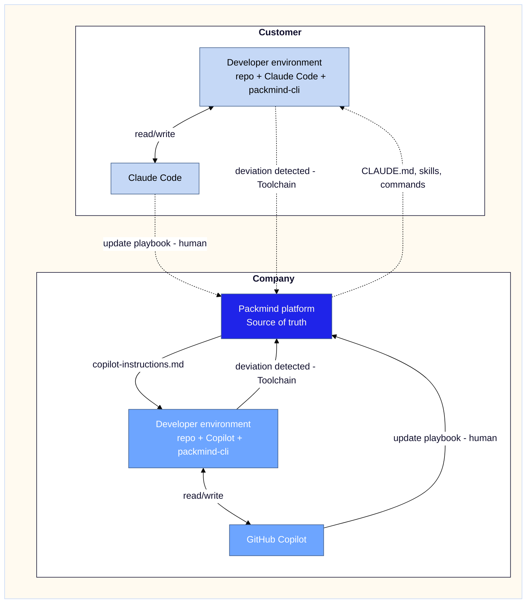

# Elevate — Mermaid Theme

Canonical source: `shared/elevate-theme/tokens.json`  
Derived from: `shared/Elevate-theme-colors.md`

---

## Approach

Elevate Mermaid theming uses a **hybrid pattern**:

- `%%{init}%%` — minimal block, used only for `edgeLabelBackground` (not controllable via `classDef`)
- `classDef` — all node and subgraph container styling
- `linkStyle default` — edge label text color

**Why not `%%{init}%%` only:** `labelTextColor` is unreliable across renderers
(GitHub, Obsidian, VS Code) — it is often silently ignored and edge label text
renders white. `classDef` applied to subgraph IDs is the verified, renderer-stable
approach for container styling.

**Correction:** subgraph containers do accept `class <subgraph-id> <classname>` —
this is valid Mermaid syntax and renderer-stable as of v10+.

---

## Canonical pattern — copy-paste



---

## classDef token mapping

| Class | Role | Fill | Text | Stroke | Elevate tokens |
| :---- | :--- | :--- | :--- | :----- | :------------- |
| `main` | Outer wrapper subgraph — invisible | `#FFFAF0` | `#FFFAF0` | `#C5D8F6` | lt2 / lt2 / accent3 |
| `primary` | Primary brand nodes | `#1F24E9` | `#FFFAF0` | `#425F8B` | accent1 / lt2 / accent4 |
| `secondary` | Secondary nodes | `#6DA5FF` | `#FFFFFF` | `#425F8B` | accent2 / lt1 / accent4 |
| `tertiary` | Tertiary nodes | `#C5D8F6` | `#000000` | `#425F8B` | accent3 / dk1 / accent4 |
| `cluster` | Inner subgraph containers | `#FFFFFF` | `#0F0E2B` | `#0F0E2B` | lt1 / dk2 / dk2 |
| `ytbc` | Yet-to-be-classified nodes | `#D9E4F0` | `#3A3A4A` | `#425F8B` | (outside Elevate) / (outside Elevate) / accent4 |

---

## init block rationale

| Variable | Value | Reason |
| :--- | :--- | :--- |
| `edgeLabelBackground` | `#FFFFFF` | Matches canvas — hides the grey label box. `transparent` collapses the box and degrades rendering. Not settable via `classDef` or `linkStyle`. |

---

## linkStyle rationale

`linkStyle default color:#0F0E2B` sets edge label text to navy across all links.
Without it, label text color is renderer-dependent and frequently renders white.

---

## accent5 / accent6 — per-node only

accent5 (`#6164EB` violet-blue) and accent6 (`#8E8FEC` periwinkle) have no
subgraph-level role. Apply per-node via `classDef`:

```mermaid
  classDef alt5 fill:#6164EB,color:#FFFFFF,stroke:#0F0E2B
  classDef alt6 fill:#8E8FEC,color:#000000,stroke:#0F0E2B
```

---

| Field        | Value      |
| :----------- | :--------- |
| Version      | 1.5        |
| Last Updated | 2026-03-29 |
| Status       | Final      |
