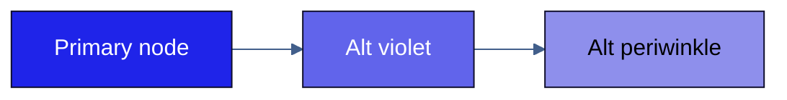

# Elevate — Mermaid Theme Init Block

Canonical source: `shared/elevate-theme/tokens.json`  
Derived from: `shared/Elevate-theme-colors.md`

---

## Usage

Paste the init block at the top of every Mermaid diagram that should use the
Elevate theme. The block must be the **first line** of the diagram definition,
before the diagram type declaration.

**Hex only:** Mermaid's theming engine recognizes hex colors only — named colors
such as `red` or `navy` are not supported and will be silently ignored.

Mermaid v11 (base theme) exposes 27+ named variables across the general theme
and diagram-specific namespaces (flowchart, sequence, etc.). The init block below
maps Elevate tokens to the general + flowchart variables. accent5 and accent6
have no direct Mermaid equivalent — apply them per-node via `classDef`.

---

## Init block — copy-paste

```
%%{init: {
  "theme": "base",
  "themeVariables": {
    "primaryColor":       "#1F24E9",
    "primaryTextColor":   "#FFFFFF",
    "primaryBorderColor": "#0F0E2B",
    "secondaryColor":     "#6DA5FF",
    "secondaryTextColor": "#000000",
    "tertiaryColor":      "#C5D8F6",
    "tertiaryTextColor":  "#000000",
    "lineColor":          "#425F8B",
    "textColor":          "#000000",
    "background":         "#FFFFFF",
    "nodeBorder":         "#0F0E2B",
    "clusterBkg":         "#FFFAF0",
    "titleColor":         "#1F24E9",
    "edgeLabelBackground":"#FFFAF0",
    "fontFamily":         "TWK Everett Light, system-ui, sans-serif"
  }
}}%%
```

---

## Token mapping rationale

| Mermaid variable     | Elevate token | Hex       | Reason |
| :------------------- | :------------ | :-------- | :----- |
| primaryColor         | accent1       | `#1F24E9` | Primary brand — main node fill |
| primaryTextColor     | lt1           | `#FFFFFF` | White text on brand fill |
| primaryBorderColor   | dk2           | `#0F0E2B` | Navy border — intentional override (not derived from primaryColor) |
| secondaryColor       | accent2       | `#6DA5FF` | Sky blue — secondary nodes |
| secondaryTextColor   | dk1           | `#000000` | Dark text on light fill |
| tertiaryColor        | accent3       | `#C5D8F6` | Ice blue — tertiary / subgraph fill; contrast vs black = ~9.5:1 ✓ |
| tertiaryTextColor    | dk1           | `#000000` | Dark text on light fill |
| lineColor            | accent4       | `#425F8B` | Steel blue — edges / connectors |
| textColor            | dk1           | `#000000` | Body text |
| background           | lt1           | `#FFFFFF` | Canvas background |
| nodeBorder           | dk2           | `#0F0E2B` | Consistent with primaryBorderColor |
| clusterBkg           | lt2           | `#FFFAF0` | Warm cream — subgraph / cluster fill |
| titleColor           | accent1       | `#1F24E9` | Brand blue for diagram title |
| edgeLabelBackground  | lt2           | `#FFFAF0` | Warm cream label background |

**primaryBorderColor note:** Mermaid auto-derives `primaryBorderColor` from
`primaryColor` when not overridden. This init block explicitly sets it to dk2
(`#0F0E2B` navy) — a deliberate design choice for stronger borders.

**Not mapped (no general Mermaid equivalent):**  
accent5 (`#6164EB` violet-blue) and accent6 (`#8E8FEC` periwinkle).
Apply per-node via `classDef` — see example below.

---

## Per-node classDef example


