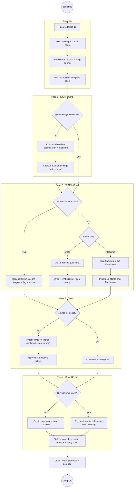

```mermaid

flowchart TD
  BEGIN((Bootstrap))

  subgraph Preamble
    P1["Resolve target dir"]
    P2["Detect which passes are done"]
    P3["Resolve & lock goal (stamp or arg)"]
    P4["Resume at first incomplete pass"]
  end

  subgraph Pass1["Pass 1 - Environment"]
    A1{"git + settings.json exist?"}
    A2["Compose baseline settings.json + .gitignore"]
    A3["Approve & write (settings written once)"]
  end

  subgraph Pass2["Pass 2 - FRAMING.md"]
    B1{"FRAMING.md exists?"}
    B2{"project size?"}
    B3["Ask 5 framing questions"]
    B4["Write FRAMING.md + goal stamp"]
    B5["Run framing-project (interview)"]
    B6["Inject goal stamp after frontmatter"]
    B7["Reconcile: minimal diff, keep wording, approve"]
  end

  subgraph Pass3["Pass 3 - Tree"]
    C1{"source files exist?"}
    C2["Document existing tree"]
    C3["Propose tree for locked goal (code: data or app)"]
    C4["Approve & create via .gitkeep"]
  end

  subgraph Pass4["Pass 4 - CLAUDE.md"]
    D1{"CLAUDE.md exists?"}
    D2["Create from locked-goal skeleton"]
    D3["Reconcile against skeleton, keep wording"]
    D4["Tail: propose deny rules + hooks; Karpathy check"]
  end

  CLOSE["Close: report produced + deferred"]
  END((Complete))

  BEGIN --> P1 --> P2 --> P3 --> P4 --> A1
  A1 -->|no| A2 --> A3 --> B1
  A1 -->|yes| B1
  B1 -->|no| B2
  B1 -->|yes| B7 --> C1
  B2 -->|Small| B3 --> B4 --> C1
  B2 -->|Medium+| B5 --> B6 --> C1
  C1 -->|no| C3 --> C4 --> D1
  C1 -->|yes| C2 --> D1
  D1 -->|no| D2 --> D4
  D1 -->|yes| D3 --> D4
  D4 --> CLOSE --> END

```
