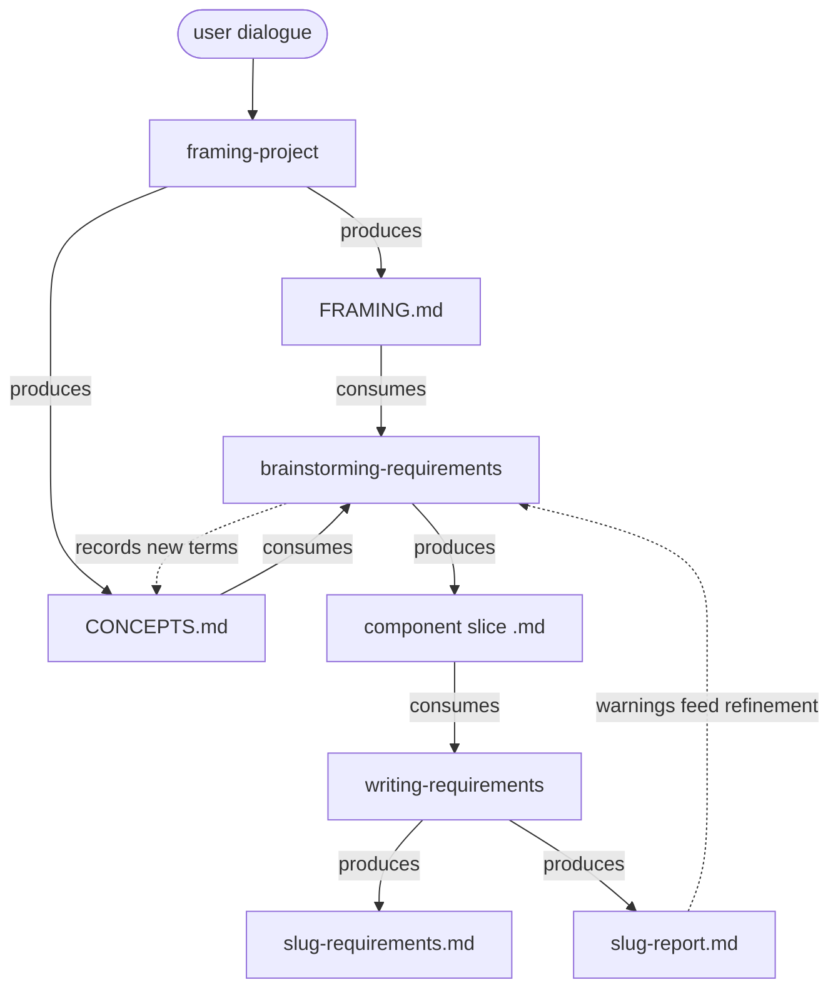

# Requirements chain — design

A reader's map of how framing, elicitation, and formalisation fit together, and why. For the rationale behind each choice, follow the source links at the end.

## The chain

Read the solid arrows as produce and consume, the dotted arrows as the two loops: brainstorming records new terms back to `CONCEPTS.md`, and the report's warnings feed the next refinement pass.

It is a requirements-refinement pipeline anchored in project framing. Framing sets intent and domain language. brainstorming-requirements elicits the what. writing-requirements writes it into a prescriptive, testable spec so that development has an unambiguous target and is predictable. Plan (the how) sits downstream and is out of scope here.

## Roles

- framing-project produces `FRAMING.md` (the intent anchor: problem, approach, who, success, tracks, out of scope) and seeds `CONCEPTS.md` (the domain language). Language and boundaries are set here, up top.
- brainstorming-requirements refines one component at a time through a one-question-per-turn interview, and emits a single component slice. It consumes `CONCEPTS.md` and records new terms back to it. It elicits, it does not write the final spec.
- writing-requirements is unchanged. It extracts a structured requirements artifact and a diagnostic report from the slice, with no synthesis: anything absent or mis-shaped comes back as `N/A` + Warning.

## The elicit-then-write seam

The load-bearing joint is brainstorming-requirements → writing-requirements. Because the downstream skill refuses to synthesise, the slice must make every decision explicit and in the exact shape the formaliser reads for. That contract lives in `brainstorming-requirements/references/elicitation-template.md`, and the gathering discipline in `elicitation-interview.md`.

Requirements are elicited in a contract: actor / action / result / conditions and limitations, written as `The <actor> shall <action>, so that <result>, when <conditions>`. This maps onto EARS downstream: the conditions clause becomes the trigger, the action becomes the SHALL response, the "so that" is carried rationale. Keeping a measurable predicate in the conditions clause is what lets the formaliser derive an acceptance criterion.

## Domain language, done the DDD way

The domain language is not a flat glossary invented during requirements. It is domain-driven design's ubiquitous language, established at framing and referenced downstream. `CONCEPTS.md` is context-structured, matching DDD's bounded contexts:

- a shared core, for terms that mean one thing everywhere
- one context block per FRAMING track (a track is a domain of work, so a candidate bounded context)
- a context map, for the relationships between contexts (who owns a term, who consumes it, where the same word diverges)

The anti-pattern this guards against: language minted late and locally drifts, and two components name the same thing differently. So brainstorming-requirements draws terms from `CONCEPTS.md` and records genuinely new ones back to it, rather than defining them inside a single slice. That guidance is written where the temptation occurs, the vocabulary step of `elicitation-interview.md`.

The context map is the same object as the seam between component slices, so at multi-component scale the domain-language structure and the fan-out structure coincide.

## What is proven, and on what

The seam was tested end to end on a real framing (Operations Orchestrator, O2), refining the ingestion-to-gold pipeline from the Data ingestion and transformation track.

- First pass, before `CONCEPTS.md`: the core mapping extracted cleanly (title, purpose, scope, actors, all requirements to EARS, all acceptance criteria derivable), with six undefined-term warnings.
- Second pass, with `CONCEPTS.md` seeded and terms drawn from it: the six term warnings cleared. One warning remains, §Constraints N/A, which is a genuine content gap (no artifact invariant was elicited), not a shape fault.

Artifacts from the run live under `outputs/seam-test-o2/` (the slice and a test `CONCEPTS.md`) and `requirements/ingestion-to-gold-pipeline/` (the requirements and report).

## Deferred (not built yet)

- Multi-component fan-out in brainstorming-requirements: one product-scope framing splitting into per-component slices.
- The system-level cross-cutting slice, and the recomposition and consistency checks (the context map as a runtime check), owned by an orchestrator above writing-requirements.
- Architectural boundary decisions, which route to making-architecture-decision, not to brainstorming.

## Sources

- Domain-driven design, ubiquitous language and bounded contexts: [Martin Fowler, Bounded Context](https://martinfowler.com/bliki/BoundedContext.html); [Agile Alliance, Ubiquitous Language](https://agilealliance.org/glossary/ubiquitous-language/); [DDD — Wikipedia](https://en.wikipedia.org/wiki/Domain-driven_design).
- Context mapping as an artifact and tool: [Context Mapper](https://contextmapper.org/); [Strategic DDD Context Map template — socadk](https://socadk.github.io/design-practice-repository/artifact-templates/DPR-StrategicDDDContextMap.html).
- Framing structure: Richard Rumelt, Good Strategy Bad Strategy (2011), via the framing-project skill.

| Field        | Value      |
|:-------------|:-----------|
| Version      | 1.0        |
| Last Updated | 2026-07-13 |
| Status       | Draft      |
