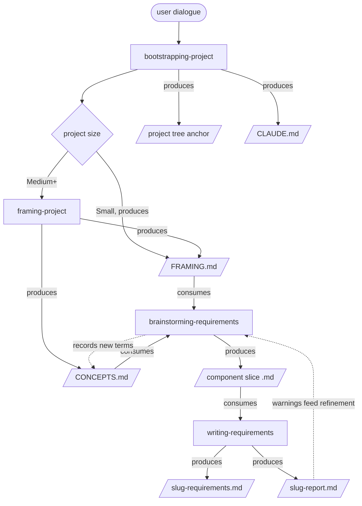

# Requirements chain — design

A reader's map of how framing, elicitation, and formalisation fit together, and why. For the rationale behind each choice, follow the source links at the end.

## The chain

Node shapes mark the two types: rectangles are activities (the skills and steps that do work), parallelograms are deliverables (the artifacts they produce). The diamond is the size decision and the rounded node is external user input.

Read the solid arrows as produce and consume, the dotted arrows as the two loops: brainstorming records new terms back to `CONCEPTS.md`, and the report's warnings feed the next refinement pass. Note the size fork: a Small project frames inline and produces no `CONCEPTS.md`; a Medium+ project delegates framing to framing-project, which also seeds `CONCEPTS.md`. That fork is the single biggest determinant of how the downstream chain behaves (see Project size below).

bootstrapping-project sets the project up (environment, framing, tree anchor, CLAUDE.md). The requirements chain proper is framing → brainstorming-requirements → writing-requirements: framing sets intent and domain language, brainstorming-requirements elicits the what, writing-requirements writes it into a prescriptive, testable spec so development has an unambiguous target and is predictable. The downstream decisions-and-design chain (the why, then the how) is out of scope here (see Downstream boundary and handoff).

## Steps: activities and deliverables

Each step is an activity (the work it performs) that yields deliverables (the durable artifacts it leaves behind). The activity is the means and persists nothing but its deliverables; the deliverables are what the next step consumes. Keeping the two apart matters twice over: a reader sees what the chain produces at a glance, and an agent running a step knows to run only the activity and to emit exactly the listed deliverables, no extra artifacts.

| Step | Activity (what it does) | Consumes | Deliverables (what it produces) |
|:--|:--|:--|:--|
| bootstrapping-project | Four-pass project setup (environment, framing, tree, CLAUDE.md); Pass 2 branches by size | user dialogue; goal (thinking / code / infra) | `.claude/` baseline config; `FRAMING.md`; project tree anchor (provisional); `CLAUDE.md` |
| ↳ Pass 2, framing | Small: inline five-question framing. Medium+: delegates to framing-project | user dialogue | Small: `FRAMING.md` only. Medium+: `FRAMING.md` + `CONCEPTS.md` (context-structured, via framing-project) |
| brainstorming-requirements | Elicits one component's requirements through a one-question-per-turn dialogue; does not write the final spec | `FRAMING.md`, `CONCEPTS.md` | one component slice `.md`; new terms appended to `CONCEPTS.md` |
| writing-requirements (unchanged) | Formalises the slice into a structured spec by extraction only, no synthesis; absent or mis-shaped signal returns as `N/A` + Warning | component slice `.md` | `<slug>-requirements.md`; `<slug>-report.md` |

Two of the arrows in the diagram are activities, not deliverables: brainstorming-requirements appending new terms to `CONCEPTS.md` is a running update to an existing deliverable, and the report's warnings driving the next elicitation pass produce no new artifact. Everything else on a solid arrow is a deliverable handed to the next step.

## Declared inputs versus design-intent roots

The Consumes column above lists what each step reads, not whether the step enforces it. Two kinds of dependency hide in that column, and the difference decides where inference runs unchecked.

A declared input is one the step's gate names and enforces: if it is missing or mis-shaped the step refuses, routes elsewhere, or flags. A design-intent root is an artifact the chain's design treats as the source of a step but which that step never reads. It is true on the map, not enforced by the gate. The test: if the artifact vanished, would the step refuse, or run on unaware? Refuse means declared input. Run on unaware means design-intent root.

This matters for code because a design-intent root is exactly where a step fills the gap by inference instead of reading the source, and that inference flows down into the ADRs, the skeleton, and the code built on them.

| Step | Declared inputs (enforced) | Design-intent roots (assumed, ungated) | If the assumed input drifts |
|:--|:--|:--|:--|
| brainstorming-requirements | `FRAMING.md`, required | `CONCEPTS.md` is soft: read if present, proceeds and records terms if absent | Vocabulary drift and undefined-term warnings downstream (see Project size) |
| writing-requirements | a markdown substrate at the given path, plus slug and type args, all hard-fail | that the substrate is a well-shaped slice: it accepts any markdown and degrades a mis-shape to `N/A` plus Warning, it does not type-check the slice | A thin or non-slice substrate yields a valid-looking spec that is hollow, full of `N/A` and Warnings |
| making-architecture-decision | the decision log and existing ADRs, plus the forcing context from the interview | framing and the requirements spec, neither is read | An ADR can diverge from framing intent and from the requirements with no gate catching it |
| writing-technical-design | the ADRs and index (routes if missing or Draft), framing (routes if missing), a named reviewer; a source inventory is soft | the requirements spec, never read | The skeleton and design, and the code built on them, conform to the ADRs and framing but are never checked against the requirements |

The load-bearing case is the requirements spec. It is a design-intent root of both downstream steps and a declared input to neither, so the code's implicit specification descends through framing and the ADRs while the actual requirements are never gate-checked against it. Framing is the second case: a declared input to `writing-technical-design` but a design-intent root of `making-architecture-decision`, so an ADR can be locked without ever reading the framing it is meant to serve.

The decision this forces on a builder: at every design-intent root, add the check the gate does not. Reconcile each ADR against framing before locking it, and at the coding and testing boundary feed the requirements acceptance criteria in as the test oracle (see Past the skeleton). That test is the only point in the chain where an executable check can catch a requirements-to-code divergence, precisely because every step between requirements and code treats the requirements as an assumed root, not a read input.

## Project size and its downstream impact

Project size is decided once, at bootstrapping Pass 2, and it propagates through the whole chain. It is the highest-leverage choice in the setup, because it fixes which anchors the requirements chain will have to work from.

| Size | Bootstrapping produces | Downstream consequence |
|:--|:--|:--|
| Small (solo, one workflow, no sponsor) | `FRAMING.md` only, no `CONCEPTS.md`, no Tracks | The requirements chain runs without a domain-language anchor: brainstorming-requirements has no term source, and writing-requirements raises undefined-term warnings (the O2 pre-`CONCEPTS.md` failure). Single-context and single-component by construction, so no fan-out. |
| Medium+ (multiple tracks, sponsor, budget) | `FRAMING.md` + context-structured `CONCEPTS.md` + Tracks | The chain has its domain-language anchor and extracts clean. Tracks are the bounded contexts that become `CONCEPTS.md` context blocks and the units the multi-component fan-out iterates. |

Three impacts worth holding:

- Domain-language anchor. The size choice, made at bootstrap, decides whether the requirements chain is clean or noisy on vocabulary. Not cosmetic: undefined terms drag the Unambiguous score and hide drift.
- Context and fan-out are Medium+ features. Only Medium+ framing yields Tracks, and Tracks are what both the context-structured `CONCEPTS.md` and the multi-component fan-out stand on. A Small project is inherently one context, one component.
- Grounding depth. Small framing is lighter (five questions, possible `🔲` gaps, no pushback), so brainstorming surfaces more open questions than on a Medium+ base.

The gate is proportionate, not a defect. A Small project is unlikely to run the heavy requirements chain, so skipping `CONCEPTS.md` and Tracks is right-sized. The one risk is a Small project entering the chain silently, and the mitigation is the upgrade path: run framing-project on it to seed `CONCEPTS.md` and Tracks, converting it to the Medium+ shape before elicitation begins.

## The elicit-then-write seam

The load-bearing joint is brainstorming-requirements → writing-requirements. Because the downstream skill refuses to synthesise, the slice must make every decision explicit and in the exact shape the formaliser reads for. That contract lives in `brainstorming-requirements/references/elicitation-template.md`, and the gathering discipline in `elicitation-interview.md`.

Requirements are elicited in a contract: actor / action / result / conditions and limitations, written as `The <actor> shall <action>, so that <result>, when <conditions>`. This maps onto EARS downstream: the conditions clause becomes the trigger, the action becomes the SHALL response, the "so that" is carried rationale. Keeping a measurable predicate in the conditions clause is what lets the formaliser derive an acceptance criterion.

## Domain language, done the DDD way

The domain language is not a flat glossary invented during requirements. It is domain-driven design's ubiquitous language, established at framing and referenced downstream. `CONCEPTS.md` is context-structured, matching DDD's bounded contexts:

- a shared core, for terms that mean one thing everywhere
- one context block per FRAMING track (a track is a domain of work, so a candidate bounded context)
- a context map, for the relationships between contexts (who owns a term, who consumes it, where the same word diverges)

The anti-pattern this guards against: language minted late and locally drifts, and two components name the same thing differently. So brainstorming-requirements draws terms from `CONCEPTS.md` and records genuinely new ones back to it, rather than defining them inside a single slice. That guidance is written where the temptation occurs, the vocabulary step of `elicitation-interview.md`.

The context map is the same object as the seam between component slices, so at multi-component scale the domain-language structure and the fan-out structure coincide.

## What is proven, and on what

The seam was tested end to end on a real framing (Operations Orchestrator, O2), refining the ingestion-to-gold pipeline from the Data ingestion and transformation track.

- First pass, before `CONCEPTS.md`: the core mapping extracted cleanly (title, purpose, scope, actors, all requirements to EARS, all acceptance criteria derivable), with six undefined-term warnings.
- Second pass, with `CONCEPTS.md` seeded and terms drawn from it: the six term warnings cleared. One warning remains, §Constraints N/A, which is a genuine content gap (no artifact invariant was elicited), not a shape fault.

The run's artifacts (the slice, a test `CONCEPTS.md`, and the requirements and report) have since been removed from the repo. The outcome recorded above is the durable record of the run, not the files.

## Downstream boundary and handoff

The requirements chain ends at `writing-requirements`. What follows is a separate, already-built chain: `making-architecture-decision` freezes the ADRs (the why), and `writing-technical-design` renders them into the artefact skeleton and the living design doc (the how). Framing is the shared upstream both chains descend from, though only `writing-technical-design` gates on it (see Declared inputs versus design-intent roots). Architectural boundary decisions route to `making-architecture-decision`, not to `brainstorming-requirements`, which elicits the what, not the how.

The seam to hold: `<slug>-requirements.md` is not a declared input to either downstream skill. `making-architecture-decision` takes its forcing context from the user, and `writing-technical-design`'s Phase 0 gate requires the ADRs, framing, and a named reviewer, not the requirements spec. So requirements reach architecture through a human anchored on framing, not through a wired artifact handoff.

Guardrail: a requirement change does not propagate downstream on its own. Nothing re-opens the ADRs or the design when a requirement moves, so re-checking the downstream chain after a requirements change is a human responsibility until the orchestrator below owns it. Keep framing current, because it is the only reference both chains share, and nothing else crosses the seam without a human.

### Past the skeleton: coding and testing

`writing-technical-design` stops at an illustrative skeleton it flags as unverified and does not run. Coding and testing sit beyond it, and beyond the authored chain: no skill here owns them, and in this repo they run on the Claude Code harness (`run`, `verify`, `code-review`), not on chain skills.

This is where inference changes character. Upstream there is no executable oracle, so the check falls back to human review, which is the weakest gate for LLM output: plausible-but-wrong reads as done, and a reviewer, not a criterion, becomes the loop. Karpathy's rule is the counter, turn the work into verifiable success criteria rather than trust inspection, and the chain applies it as far as it can without code. `brainstorming-requirements` pushes each requirement to a measurable predicate or flags it open, and `writing-requirements` derives an acceptance criterion from it, so even upstream the check is a criterion, not an opinion. Coding and testing are the first stage with a real oracle, so that criterion finally executes: the model writes, runs the tests against those acceptance criteria, reads the result, and iterates until they pass. A human-judgment gate is a placeholder for a verifiable one, not the destination, and the upstream discipline of forcing measurable predicates is what makes the downstream test meaningful.

Guardrail: do not let the pass that writes the code also write the only tests that check it, or the gate grades its own homework and a green run is false comfort. Feed the acceptance criteria from `<slug>-requirements.md` in as the test oracle, and have a fresh reviewer or subagent try to refute the result rather than the author confirming it.

## Deferred (not built yet)

- Multi-component fan-out in brainstorming-requirements (Phase 3.5): one product-scope framing splitting into per-component slices.
- The system-level cross-cutting slice, and the recomposition and consistency checks (the context map as a runtime check), owned by an orchestrator above writing-requirements. The same orchestrator would own the downstream seam above: propagating a requirements change into the decisions-and-design chain, which today is manual.
- Visual and blindspot gates: review gates named at session time and carried here as a deferral. Their scope is not yet defined in writing, so this records the intent to build them, not a specification of what they check.

## Sources

- Domain-driven design, ubiquitous language and bounded contexts: [Martin Fowler, Bounded Context](https://martinfowler.com/bliki/BoundedContext.html); [Agile Alliance, Ubiquitous Language](https://agilealliance.org/glossary/ubiquitous-language/); [DDD — Wikipedia](https://en.wikipedia.org/wiki/Domain-driven_design).
- Context mapping as an artifact and tool: [Context Mapper](https://contextmapper.org/); [Strategic DDD Context Map template — socadk](https://socadk.github.io/design-practice-repository/artifact-templates/DPR-StrategicDDDContextMap.html).
- Framing structure: Richard Rumelt, Good Strategy Bad Strategy (2011), via the framing-project skill.

| Field        | Value      |
|:-------------|:-----------|
| Version      | 1.9        |
| Last Updated | 2026-07-13 |
| Status       | Draft      |
