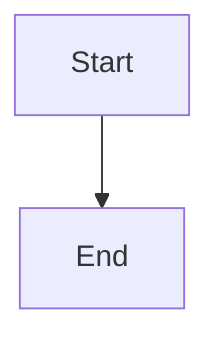

# Markdown Formatting Reference

Read this file when the output is a `.md` file. These rules ensure correct
rendering in MarkText, Obsidian, VS Code, and GitHub.

---

## Headers

- ATX-style (`#`) only — never setext (`===` / `---`)
- Always add a blank line after every header
- Never skip levels (H1 → H3 is invalid)

---

## Tables

Always use explicit alignment. Missing alignment markers is the most common
rendering failure.

```markdown
| Column A | Column B | Column C |
| :---     | ---:     | :---:    |
| left     | right    | center   |
```

- `:---` left (default for text) · `---:` right (numbers) · `:---:` center (status/boolean)
- Always add a blank line before **and** after a table — including when it follows a bold label

**Wrong — will break in MarkText:**

```markdown
**Label:**
| Col | Col |
| :-- | :-- |
```

**Correct:**

```markdown
**Label:**

| Col | Col |
| :-- | :-- |
```

---

## Code Blocks

Always fenced with a language identifier. Never use 4-space indented blocks.

````markdown
```bash
npm install
```

```json
{ "key": "value" }
```

```powershell
$env:APPDATA\Claude\claude_desktop_config.json
```
````

---

## Mermaid Diagrams

Preferred format for any flowchart, sequence diagram, or architecture visual.

````markdown

````

Renders natively in Obsidian, GitHub, and VS Code (with extension). Do **not**
replace with ASCII art unless the target environment is confirmed to not support
Mermaid.

---

## Lists

- Use `-` for unordered lists
- Add a blank line before a list that follows a paragraph
- Keep punctuation consistent across all items (all end with `.` or none do)

---

## Emphasis

- Bold: `**text**` — never `__double underscore__` (unreliable in some parsers)
- Italic: `*text*`
- Inline code: `` `text` ``

---

## Links & URLs

Never use bare URLs. Always wrap: `[Display text](https://url.com)`

---

## Horizontal Rules

`---` on its own line with blank lines above and below.

---

## Document Structure Template

````markdown
# Document Title
> Subtitle or context line
> Version X.X — Author — YYYY-MM-DD

---

## Section One

Content paragraph.

### Subsection

More content.

---

## Section Two

| Column | Column |
| :---   | :---   |
| value  | value  |

---

*Footer note or cross-reference*
````

---

## QA Checklist

- [ ] Tables use `:---` alignment syntax
- [ ] Blank line before and after every table (including after bold labels)
- [ ] Blank line after every header
- [ ] Code blocks fenced with language identifier
- [ ] Mermaid diagrams use ` ```mermaid ` fence
- [ ] No bare URLs
- [ ] No skipped header levels
- [ ] JSON blocks validated (no trailing commas, balanced brackets)
- [ ] File saved as `.md`
